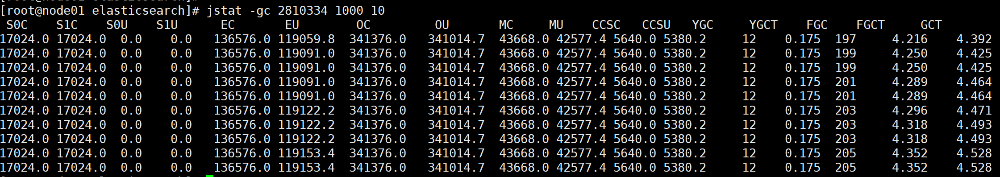
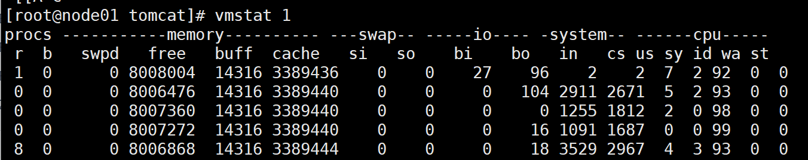

<!-- more -->


# 一、JAVA 相关命令

## 1.jps
jps - Lists the instrumented Java Virtual Machines (JVMs) on the target system. This command is experimental and unsupported.

相关参数
```
OPTIONS
       The jps command supports a number of options that modify the output of the command. These options are subject to change or removal in the future.
       -q
              Suppresses the output of the class name, JAR file name, and arguments passed to the main method, producing only a list of local JVM identifiers.
       -m
              Displays the arguments passed to the main method. The output may be null for embedded JVMs.
       -l
              Displays the full package name for the application's main class or the full path name to the application's JAR file.
       -v
              Displays the arguments passed to the JVM.
       -V
              Suppresses the output of the class name, JAR file name, and arguments passed to the main method, producing only a list of local JVM identifiers.
       -Joption
              Passes option to the JVM, where option is one of the options described on the reference page for the Java application launcher. For example, -J-Xms48m sets the
              startup memory to 48 MB. See java(1).
```

## 2.jinfo
jinfo（Java Virtual Machine Configuration Information）是JDK提供的一个可以实时查看Java虚拟机各种配置参数和系统属性的命令行工具。使用jps命令的-v参数可以查看Java虚拟机启动时显式指定的配置参数，如果想查看没有显式指定的配置参数就可以使用jinfo命令进行查看。另外，jinfo命令还可以查询Java虚拟机进程的System.getProperties()的内容。

以tomcat进程为例
```
Attaching to process ID 2045, please wait...
Debugger attached successfully.
Server compiler detected.
JVM version is 25.242-b08
Java System Properties:

java.vendor = Huawei Technologies Co., Ltd
sun.java.launcher = SUN_STANDARD
catalina.base = /usr/share/tomcat
sun.management.compiler = HotSpot 64-Bit Tiered Compilers
sun.nio.ch.bugLevel = 
catalina.useNaming = true
jnidispatch.path = /var/cache/tomcat/temp/jna--903012287/jna4240128671455089550.tmp
os.name = Linux
sun.boot.class.path = /usr/lib/jvm/java-1.8.0-openjdk-1.8.0.242.b08-1.h5.ky10.x86_64/jre/lib/resources.jar:/usr/lib/jvm/java-1.8.0-openjdk-1.8.0.242.b08-1.h5.ky10.x86_64/jre/lib/rt.jar:/usr/lib/jvm/java-1.8.0-openjdk-1.8.0.242.b08-1.h5.ky10.x86_64/jre/lib/sunrsasign.jar:/usr/lib/jvm/java-1.8.0-openjdk-1.8.0.242.b08-1.h5.ky10.x86_64/jre/lib/jsse.jar:/usr/lib/jvm/java-1.8.0-openjdk-1.8.0.242.b08-1.h5.ky10.x86_64/jre/lib/jce.jar:/usr/lib/jvm/java-1.8.0-openjdk-1.8.0.242.b08-1.h5.ky10.x86_64/jre/lib/charsets.jar:/usr/lib/jvm/java-1.8.0-openjdk-1.8.0.242.b08-1.h5.ky10.x86_64/jre/lib/jfr.jar:/usr/lib/jvm/java-1.8.0-openjdk-1.8.0.242.b08-1.h5.ky10.x86_64/jre/classes
java.vm.specification.vendor = Oracle Corporation
java.runtime.version = 1.8.0_242-b08
jna.loaded = true
user.name = xxx
tomcat.util.scan.StandardJarScanFilter.jarsToScan = taglibs-standard-impl*.jar
shared.loader = 
tomcat.util.buf.StringCache.byte.enabled = true
user.language = en
java.naming.factory.initial = org.apache.naming.java.javaURLContextFactory
sun.boot.library.path = /usr/lib/jvm/java-1.8.0-openjdk-1.8.0.242.b08-1.h5.ky10.x86_64/jre/lib/amd64
java.version = 1.8.0_242
java.util.logging.manager = org.apache.juli.ClassLoaderLogManager
user.timezone = Asia/Shanghai
sun.arch.data.model = 64
java.util.concurrent.ForkJoinPool.common.threadFactory = org.apache.catalina.startup.SafeForkJoinWorkerThreadFactory
java.endorsed.dirs = 
sun.cpu.isalist = 
sun.jnu.encoding = UTF-8
file.encoding.pkg = sun.io
package.access = sun.,org.apache.catalina.,org.apache.coyote.,org.apache.jasper.,org.apache.tomcat.
file.separator = /
java.specification.name = Java Platform API Specification
java.class.version = 52.0
user.country = US
java.home = /usr/lib/jvm/java-1.8.0-openjdk-1.8.0.242.b08-1.h5.ky10.x86_64/jre
java.vm.info = mixed mode
os.version = 4.19.90-24.4.v2101.ky10.x86_64
sun.font.fontmanager = sun.awt.X11FontManager
path.separator = :
java.vm.version = 25.242-b08
jboss.i18n.generate-proxies = true
java.awt.printerjob = sun.print.PSPrinterJob
sun.io.unicode.encoding = UnicodeLittle
awt.toolkit = sun.awt.X11.XToolkit
package.definition = sun.,java.,org.apache.catalina.,org.apache.coyote.,org.apache.jasper.,org.apache.naming.,org.apache.tomcat.
java.naming.factory.url.pkgs = org.apache.naming
mail.mime.splitlongparameters = false
java.security.egd = file:/dev/./urandom
user.home = /home/shterm
java.specification.vendor = Oracle Corporation
tomcat.util.scan.StandardJarScanFilter.jarsToSkip = activ*.jar,amqp-client.jar,annotations-api.jar,ant-junit*.jar,ant-launcher.jar,ant.jar,antlr.jar,aopalliance.jar,asm-*.jar,aspectj*.jar,bcp*.jar,bootstrap.jar,catalina-ant.jar,catalina-ha.jar,catalina-jmx-remote.jar,catalina-storeconfig.jar,catalina-tribes.jar,catalina-ws.jar,catalina.jar,cglib-*.jar,classmate.jar,cobertura-*.jar,commons-*.jar,compress-lzf.jar,curator-*.jar,db2-jdbc.jar,dom4j-*.jar,easymock-*.jar,ecj-*.jar,el-api.jar,elasticsearch.jar,geronimo-spec-jaxrpc*.jar,groovy-all.jar,guava.jar,h2*.jar,hamcrest-*.jar,hibernate*.jar,hppc.jar,http*.jar,icu4j-*.jar,itext*.jar,jackson-*.jar,jandex.jar,jasper-el.jar,jasper.jar,jasperreports*.jar,jaspic-api.jar,javamail.jar,javassist.jar,jaxb-*.jar,jaxen*.jar,jboss*.jar,jc*.jar,jdom-*.jar,jedis.jar,jetty-*.jar,jfreechart.jar,jgit.jar,jline.jar,jmx-tools.jar,jmx.jar,jna.jar,joda-time.jar,jr-*.jar,jsch.jar,json*.jar,jsoup.jar,jsp-api.jar,jsr166e.jar,jstl.jar,jta*.jar,junit-*.jar,junit.jar,liquibase-*.jar,log4j*.jar,lucene*.jar,mail*.jar,mariadb-jdbc.jar,mssql-jdbc.jar,mybatis.jar,netty.jar,nmap4j.jar,objenesis*.jar,olap4j.jar,opc*.jar,oracle-jdbc.jar,oraclepki.jar,oro-*.jar,poi*.jar,postgresql-jdbc.jar,quartz.jar,servlet-api-*.jar,servlet-api.jar,slf4j*.jar,snakeyaml.jar,snmp4j.jar,spring*.jar,sshd-core.jar,taglibs-standard-spec-*.jar,tagsoup-*.jar,t-digest.jar,tomcat-api.jar,tomcat-coyote.jar,tomcat-dbcp.jar,tomcat-i18n-*.jar,tomcat-jdbc.jar,tomcat-jni.jar,tomcat-juli-adapters.jar,tomcat-juli.jar,tomcat-util-scan.jar,tomcat-util.jar,tomcat-websocket.jar,tools.jar,validation-api.jar,velocypack.jar,websocket-api.jar,wl*.jar,wsdl4j*.jar,xercesImpl.jar,xml-apis.jar,xmlbeans.jar,xmlParserAPIs-*.jar,xmlParserAPIs.jar,xom-*.jar,xz.jar,zip4j.jar,zookeeper.jar
java.library.path = /usr/java/packages/lib/amd64:/usr/lib64:/lib64:/lib:/usr/lib
java.vendor.url = http://jdk.rnd.huawei.com/
java.vm.vendor = Huawei Technologies Co., Ltd
common.loader = "${catalina.base}/lib","${catalina.base}/lib/*.jar","${catalina.home}/lib","${catalina.home}/lib/*.jar"
java.runtime.name = OpenJDK Runtime Environment
sun.java.command = org.apache.catalina.startup.Bootstrap start
java.class.path = /usr/share/tomcat/bin/bootstrap.jar:/usr/share/tomcat/bin/tomcat-juli.jar:/usr/lib/java/commons-daemon.jar
java.vm.specification.name = Java Virtual Machine Specification
java.vm.specification.version = 1.8
catalina.home = /usr/share/tomcat
sun.cpu.endian = little
sun.os.patch.level = unknown
java.awt.headless = true
java.io.tmpdir = /var/cache/tomcat/temp
java.vendor.url.bug = http://jdk.rnd.huawei.com/
server.loader = 
java.rmi.server.hostname = 127.0.0.1
jna.platform.library.path = /usr/lib64:/lib64:/usr/lib:/lib:/usr/lib64/tracker-miners-2.0:/usr/lib64/tracker-2.0:/usr/lib64/dyninst:/usr/libexec/sudo:/usr/lib64/sssd:/usr/pgsql-9.6/lib:/usr/lib64/perl5/CORE:/usr/lib64/opencryptoki:/usr/lib/jvm/java-1.8.0-openjdk-1.8.0.242.b08-1.h5.ky10.x86_64/jre/lib/amd64/jli:/usr/lib64/bind9-export
os.arch = amd64
java.awt.graphicsenv = sun.awt.X11GraphicsEnvironment
java.ext.dirs = /usr/lib/jvm/java-1.8.0-openjdk-1.8.0.242.b08-1.h5.ky10.x86_64/jre/lib/ext:/usr/java/packages/lib/ext
user.dir = /usr/share/tomcat
line.separator = 

java.vm.name = OpenJDK 64-Bit Server VM
log4j.configurationFile = /etc/tomcat/log4j2.xml
file.encoding = UTF-8
com.sun.jndi.ldap.object.disableEndpointIdentification = 
java.specification.version = 1.8

VM Flags:
Non-default VM flags: -XX:CICompilerCount=4 -XX:GCLogFileSize=20971520 -XX:+HeapDumpOnOutOfMemoryError -XX:HeapDumpPath=null -XX:InitialHeapSize=243269632 -XX:MaxHeapSize=1610612736 -XX:MaxNewSize=536870912 -XX:MinHeapDeltaBytes=524288 -XX:NewSize=80740352 -XX:NumberOfGCLogFiles=15 -XX:OldSize=162529280 -XX:+PrintGC -XX:+PrintGCDateStamps -XX:+PrintGCDetails -XX:+PrintGCTimeStamps -XX:+UseCompressedClassPointers -XX:+UseCompressedOops -XX:+UseGCLogFileRotation -XX:+UseParallelGC 
Command line:  -Xmx1536m -Djava.security.egd=file:/dev/./urandom -Djava.awt.headless=true -XX:+HeapDumpOnOutOfMemoryError -XX:HeapDumpPath=/var/log/tomcat -XX:+UseGCLogFileRotation -XX:NumberOfGCLogFiles=15 -XX:GCLogFileSize=20m -XX:+PrintGCDateStamps -XX:+PrintGCDetails -Xloggc:/var/log/tomcat/tomcat-gc-%t.log -Dcom.sun.jndi.ldap.object.disableEndpointIdentification -Dcatalina.base=/usr/share/tomcat -Dcatalina.home=/usr/share/tomcat -Djava.endorsed.dirs= -Djava.io.tmpdir=/var/cache/tomcat/temp -Dlog4j.configurationFile=/etc/tomcat/log4j2.xml -Djava.util.logging.manager=org.apache.juli.ClassLoaderLogManager
```

## 3.jstat
命令参数说明：
- generalOptions：通用选项，如果指定一个通用选项，就不能指定任何其他选项或参数。它包括如下两个选项：
- -help：显示帮助信息。
- -options：显示outputOptions参数的列表。
- outputOptions：输出选项，指定显示某一种Java虚拟机信息。
- -t：把时间戳列显示为输出的第一列。这个时间戳是从Java虚拟机的开始运行到现在的秒数。
- -h n：每显示n行显示一次表头，其中n为正整数。默认值为 0，即仅在第一行数据显示一次表头。
- vmid：虚拟机唯一ID（LVMID，Local Virtual Machine Identifier），如果查看本机就是Java进程的进程ID。
- interval：显示信息的时间间隔，单位默认毫秒。也可以指定秒为单位，比如：1s。如果指定了该参数，jstat命令将每隔这段时间显示一次统计信息。
- count：显示数据的次数，默认值是无穷大，这将导致jstat命令一直显示统计信息，直到目标JVM终止或jstat命令终止。
输出选项
如果不指定通用选项（generalOptions），则可以指定输出选项（outputOptions）。输出选项决定jstat命令显示的内容和格式，具体如下：
- -class：显示类加载、卸载数量、总空间和装载耗时的统计信息。
- -compiler：显示即时编译的方法、耗时等信息。
- -gc：显示堆各个区域内存使用和垃圾回收的统计信息。
- -gccapacity：显示堆各个区域的容量及其对应的空间的统计信息。
- -gcutil：显示有关垃圾收集统计信息的摘要。
- -gccause：显示关于垃圾收集统计信息的摘要(与-gcutil相同)，以及最近和当前垃圾回收的原因。
- -gcnew：显示新生代的垃圾回收统计信息。
- -gcnewcapacity：显示新生代的大小及其对应的空间的统计信息。
- -gcold: 显示老年代和元空间的垃圾回收统计信息。
- -gcoldcapacity：显示老年代的大小统计信息。
- -gcmetacapacity：显示元空间的大小的统计信息。
- -printcompilation：显示即时编译方法的统计信息。

# 二、线程堆栈
## 1.输出
Java虚拟机提供了线程转储(Thread dump)的后门，通过这个后门，可以将线程堆栈打印出来。这个后门就是通过向Java进程发送一个QUIT信号，Java虚拟机收到该信号之后，将系统当前的JAVA线程调用堆栈打印出来。

打印方法：
- jstack -l pid > xxx.txt 需要注意的是，linux系统中往往会用不同的用户去执行不同的程序，此时可能需要通过sudu -u xxx jstack的形式
- kill -3
***同时请确保Java命令行中没有DISABLE_JAVADUMP运行选项***
## 2.线程分析
通过输出堆栈进行分析 `jstack -l $(jps | grep xxx | awk '{print $1}')` > /tmp/xxx.jstack
```Lua
"SYS_STATUS_CHECKER" #14 daemon prio=5 os_prio=0 tid=0x00007f5e047bf000 nid=0xe15 waiting on condition [0x00007f5dd43d1000]
    java.lang.Thread.State: TIMED_WAITING (sleeping)
        at java.lang.Thread.sleep(Native Method)
ru        at com.xxx.xxx.SystemStatusChecker.run(SystemStatusChecker.java:xx)
        at java.lang.Thread.run(Thread.java:748)        
    Locked ownable synchronizers:
        - None
                
"RMI Reaper" #39 prio=5 os_prio=0 tid=0x00007f5e04e4c800 nid=0xf0b in Object.wait() [0x00007f5dae2c4000]
    java.lang.Thread.State: WAITING (on object monitor)
        at java.lang.Object.wait(Native Method)
        - waiting on <0x00000000c0c88d20> (a java.lang.ref.ReferenceQueue$Lock)
        at java.lang.ref.ReferenceQueue.remove(ReferenceQueue.java:144)
        - locked <0x00000000c0c88d20> (a java.lang.ref.ReferenceQueue$Lock)
        at java.lang.ref.ReferenceQueue.remove(ReferenceQueue.java:165)
        at sun.rmi.transport.ObjectTable$Reaper.run(ObjectTable.java:351)
        at java.lang.Thread.run(Thread.java:748)
    Locked ownable synchronizers:
        - None
        
"main" #1 prio=5 os_prio=0 tid=0x00007f5e0400a000 nid=0xdcb runnable [0x00007f5e0b393000]
    java.lang.Thread.State: RUNNABLE
        at java.net.PlainSocketImpl.socketAccept(Native Method)
        at java.net.AbstractPlainSocketImpl.accept(AbstractPlainSocketImpl.java:409)
        at java.net.ServerSocket.implAccept(ServerSocket.java:545)
        at java.net.ServerSocket.accept(ServerSocket.java:513)
        at com.xxx.common.xxx.await(CommonMain.java:244)
        at com.xxx.common.xxx.startup(CommonMain.java:207)
        at com.xxx.common.xxx.main(CommonMain.java:147)
    Locked ownable synchronizers:
        - None
```
在RMI线程中可以看到 " - locked <0x00000000c0c88d20> (a java.lang.ref.ReferenceQueue$Lock)" 表示该线程已经使用了ID为"0x00000000c0c88d2"的锁，锁的ID由系统自动产生
```
"main"  prio=5     os_prio=0          tid=0x00007f5e0400a000 nid=0xdcb      runnable [0x00007f5e0b393000]
|       |          |                  |                      |              |         |
线程名称 线程优先级   操作系统级别的优先级   线程id                 对应的本地线程ID  状态      线程占用内存地址
```

其中"线程对应的本地线程id号"所指的"本地线程"是指该Java线程所对应的虚拟机中的本地线程。我们知道Java是解析型语言，执行的实体是Java虚拟机，因此Java语言中的线程是 依附于Java虚拟机中的本地线程来运行的，实际上是本地线程在执行Java线程代码。

Java代码 中创建一个thread，虚拟机在运行期就会创建一个对应的本地线程，而这个本地线程才是真正的线程实体。为了更加深入得理解本地线程和Java线程的关系，在Unix/Linux下，我们可以通 如下方式把Java虚拟机的本地线程打印出来：
- 使用ps -ef | grep java 获得Java进程ID。
- 使用pstack <java pid>获得Java虚拟机的本地线程的堆栈
其中本地线程各项含义如下：
```
Thread 56 (Thread 0x7f5e0b394700 (LWP 3531))
|                 |                 |
|                 |                 +----本地线程id(另一种表示,LWP-light weight process)
|                 +-------------------本地线程id
+------------------------------线程名称
```
而通过jstack输出的main本地线程ID为0xdcb，其10进制正好为3531。

"runnable"表示当前线程处于运行状态。这个runnable状态是从虚拟机的角度来看的, 表示这个线程正在运行
<p><strong>⚠️ NOTE:</strong> 但是处于Runnable状态的线程不一定真的消耗CPU. 处于Runnable的线程只能说明该线程没有阻塞在java的wait或者sleep方法上，同时也没等待在锁上面。但是如果该线程调用了本地方法，而本地方法处于等待状态，这个时候虚拟机是不知道本地代码中发生 了什么（但操作系统是知道的，pstack就是操作提供的一个命令，它知道当前线程正在执行的本地代码上下文），此时尽管当前线程实际上也是阻塞的状态，但实际上显示出来的还是runnable状态， 这种情况下是不消耗CPU的</p>

```
1. 处于waittig和blocked状态的线程都不会消耗CPU 
2. 线程频繁地挂起和唤醒需要消耗CPU, 而且代价颇大
```
- TIMED_WAITING(on object monitor) 表示当前线程被挂起一段时间,说明该线程正在 执行obj.wait(int time)方法.
- TIMED_WAITING(sleeping) 表示当前线程被挂起一段时间,即正在执行Thread.sleep(int time)方法. 
- TIMED_WAITING(parking) 当前线程被挂起一段时间,即正在执行Thread.sleep(int time)方法.
- WAINTING(on object monitor) 当前线程被挂起，即正在执行obj.wait()方法(无参数的wait()方法).
```
处于TIMED_WAITING、WAINTING状态的线程一定不消耗CPU. 处于RUNNABLE的线程，要结合当前线程代码的性质判断，是否消耗CPU.
• 如果是纯Java运算代码，则消耗CPU.
• 如果是网络IO,很少消耗CPU.
• 如果是本地代码，结合本地代码的性质判断(可以通过pstack/gstack获取本地线程堆栈)， 如果是纯运算代码，则消耗CPU, 如果被挂起，则不消耗CPU,如果是IO,则不怎么消 耗CPU。
```
# 三、相关的排查方法
## 1.CPU
生产环境中往往会出现CPU飙高的情况，对于JAVA应用而言，此类问题相对较好确定问题方向。
### 1.1 使用jstack确定CPU占用高的线程\
通过`top`指令，可以看到进程占用的一些基础资源信息，然后“P”键可以按照CPU使用率进行排序，“M”键可以按照内存占用情况进行排序

找到CPU占用高的进程pid，然后将jstack信息定向到一个文件中去，通过`top -Hp pid`查看具体的情况。

通过 `printf '%x\n' pid`将pid转换为16进制，然后在jstack文件中根据对应的数字进行查找，然后针对性的进行分析
### 1.2 频繁GC
有时候我们可以先确定下gc是不是太频繁，使用`jstat -gc pid 1000`命令来对gc分代变化情况进行观察，1000表示采样间隔(ms)，`S0C/S1C、S0U/S1U、EC/EU、OC/OU、MC/MU`分别代表两个Survivor区、Eden区、老年代、元数据区的容量和使用量。`YGC/YGT、FGC/FGCT、GCT`则代表YoungGc、FullGc的耗时和次数以及总耗时。如果看到gc比较频繁，再针对gc方面做进一步分析。

### 1.3 频繁上下文切换
针对频繁上下文问题，我们可以使用vmstat命令来进行查看

cs(context switch)一列则代表了上下文切换的次数。

如果我们希望对特定的pid进行监控那么可以使用 `pidstat -w pid`命令，cswch和nvcswch表示自愿及非自愿切换。

## 2.内存
对于JAVA应用，涉及到的内存问题主要包括OOM、GC问题和堆外内存。
### 2.1 OOM
JVM中的内存不足，OOM大致可以分为以下几种情况
- `Exception in thread "main" java.lang.OutOfMemoryError: unable to create new native thread` 这个意思是没有足够的内存空间给线程分配java栈，基本上还是线程池代码写的有问题，比如说忘记shutdown，所以说应该首先从代码层面来寻找问题，使用jstack或者jmap。如果一切都正常，JVM方面可以通过指定Xss来减少单个thread stack的大小。另外也可以在系统层面，可以通过修改`/etc/security/limits.confnofile`和`nproc`来增大os对线程的限制
- `Exception in thread "main" java.lang.OutOfMemoryError: Java heap space ` 这个意思是堆的内存占用已经达到-Xmx设置的最大值，应该是最常见的OOM错误了。解决思路仍然是先应该在代码中找，怀疑存在内存泄漏，通过jstack和jmap去定位问题。如果说一切都正常，才需要通过调整Xmx的值来扩大内存。
- `Caused by: java.lang.OutOfMemoryError: Meta space` 这个意思是元数据区的内存占用已经达到`XX:MaxMetaspaceSize`设置的最大值，排查思路和上面的一致，参数方面可以通过`XX:MaxPermSize`来进行调整
- `Exception in thread "main" java.lang.StackOverflowError` 表示线程栈需要的内存大于Xss值，同样也是先进行排查，参数方面通过Xss来调整，但调整的太大可能又会引起OOM。
### 2.2 GC问题
gc问题除了影响cpu也会影响内存，排查思路也是一致的。一般先使用jstat来查看分代变化情况，比如youngGC或者fullGC次数是不是太多呀；EU、OU等指标增长是不是异常等。

线程的话太多而且不被及时gc也会引发oom，大部分就是之前说的`unable to create new native thread`。除了jstack细细分析dump文件外，我们一般先会看下总体线程，通过`pstreee -p pid |wc -l`
### 2.3 堆外内存
JVM 的堆外内存主要包括：
- JVM 自身运行占用的空间；
- 线程栈分配占用的系统内存；
- DirectByteBuffer 占用的内存；
- JNI 里分配的内存；
- Java 8 开始的元数据空间；
- NIO 缓存
- Unsafe 调用分配的内存；
- codecache

冰山对象：冰山对象是指在 JVM 堆里占用的内存很小，但其实引用了一块很大的本地内存。DirectByteBuffer 和 线程都属于这类对象。
#### 2.3.1NMT分析堆外内存
NMT（Native Memory Tracking）是 HotSpot JVM 引入的跟踪 JVM 内部使用的本地内存的一个特性，可以通过 jcmd 工具访问 NMT 数据。NMT 目前不支持跟踪第三方本地代码的内存分配和 JDK 类库。

NMT 不跟踪非 JVM 代码的内存分配，本地代码里的内存泄露需要使用操作系统支持的工具来定位。

#### 2.3.2 开启 NMT
启用 NMT 会带来 5-10% 的性能损失。NMT 的内存使用率情况需要添加两个机器字 word 到 malloc 内存的 malloc 头里。NMT 内存使用率也被 NMT 跟踪。
启动命令： `-XX:NativeMemoryTracking=[off | summary | detail]`。
- off：NMT 默认是关闭的；
- summary：只收集子系统的内存使用的总计数据；
- detail：收集每个调用点的内存使用数据。

#### 2.3.3 jcmd 访问 NMT 数据
命令：
`jcmd <pid> VM.native_memory [summary | detail | baseline | summary.diff | detail.diff | shutdown] [scale= KB | MB | GB]`

