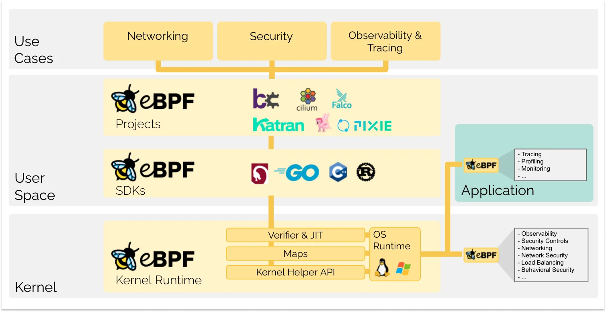

# {{ title }}

This article was written by {{ author }} on {{ date }}.

<!-- Your content starts here -->
最初接触到 ebpf 是在调研监控系统的时候，发现了这门比较“新颖”的技术（之前没有接触过）；而且在之前接触到的一些系统中还没有直接的使用过这个技术，所以产生了非常强强烈的好奇心，经过不断的了解之后觉得这个东西应该是未来监控系统和系统性能调优所不可或缺的。

会尝试将ebpf 做成一个系列，而且也接触不久，所以关于这个系列的更新的频率总体来说应该比较慢，需要不断尝试验证做积累。学习过程中也有可能走到误区之中，所以文章中也会存在不足和错误，欢迎大家指正交流。

# 什么是 eBPF

首先我们来看一下官网的介绍:

eBPF的核心是一个位于内核中的高效虚拟机。它最初的目的是高效的网络帧过滤，这使得这个虚拟机和eBPF成为处理事件的理想引擎。

eBPF 是一项革命性的技术，起源于 Linux 内核，它可以在特权上下文中（如操作系统内核）运行沙盒程序。它用于安全有效地扩展内核的功能，而无需通过更改内核源代码或加载内核模块的方式来实现。

从历史上看，由于内核具有监督和控制整个系统的特权，操作系统一直是实现可观测性、安全性和网络功能的理想场所。同时，由于操作系统内核的核心地位和对稳定性和安全性的高要求，操作系统内核很难快速迭代发展。因此在传统意义上，与在操作系统本身之外实现的功能相比，操作系统级别的创新速度要慢一些。

eBPF 从根本上改变了这个方式。通过允许在操作系统中运行沙盒程序的方式，应用程序开发人员可以运行 eBPF 程序，以便在运行时向操作系统添加额外的功能。然后在 JIT 编译器和验证引擎的帮助下，操作系统确保它像本地编译的程序一样具备安全性和执行效率。这引发了一股基于 eBPF 的项目热潮，它们涵盖了广泛的用例，包括下一代网络实现、可观测性和安全功能等领域。

如今，eBPF 被广泛用于驱动各种用例:在现代数据中心和云原生环境中提供高性能网络和负载均衡，以低开销提取细粒度的安全可观测性数据，帮助应用程序开发人员跟踪应用程序，为性能故障排查、预防性的安全策略执行(包括应用层和容器运行时)提供洞察，等等。

# eBPF能做什么

## 网络性能优化与管理

1. 高效的数据包过滤和路由:eBPF 最初用于数据包过滤，现在可以直接处理、过滤、转发数据包，用于防火墙和负载均衡等应用。与传统的 iptables 或 ipvs 不同，eBPF 在内核中处理数据包，极大地提升了性能和效率。
2. 服务网格和负载均衡:eBPF 可用于实现无代理的服务网格，如 Cilium，替代传统代理，减少网络延迟、节省资源。
3. 流量监控与 QoS 控制:eBPF 可以实时收集网络流量数据、延迟信息等，进行带宽控制和 QoS（服务质量）优化。

## 系统检测和可观测性

1. 高效系统追踪和监控:eBPF 通过内核探针（kprobes）和用户探针（uprobes）能够监控系统调用、文件访问、网络活动等，为性能分析提供了丰富的实时数据。
2. 低开销的应用监控:eBPF 不需要传统监控代理，直接在内核中获取 CPU 使用率、内存消耗、磁盘 I/O 等性能指标，减少了资源消耗。
3. 详细性能分析工具:通过工具如 BPFTrace 和 bcc，可以捕获系统级事件，生成详细的性能分析报告，帮助开发者发现性能瓶颈。

## 容器与云原生应用

1. 	Kubernetes 网络与安全插件:eBPF 广泛应用于 Kubernetes，如 Cilium 利用 eBPF 实现容器网络管理和安全策略控制。它可以在内核中处理容器间的网络隔离、策略控制和流量限制。
2. 容器性能监控和调优:eBPF 可以在不侵入容器的情况下监控其资源使用，避免对容器环境的额外开销。
3. 容器的安全监控:通过 eBPF 可以监控容器的系统调用，检测异常行为，帮助进行实时的入侵检测。

## 安全与异常检测

1. 实时入侵检测:eBPF 可以监控系统调用、网络活动、文件操作等，对比正常行为模式，实时发现并响应潜在的安全威胁。
2. 系统安全增强:通过 eBPF 可以限制特定系统调用，甚至可以动态更新安全策略，防止恶意进程或攻击行为。
3. 行为分析:eBPF 还可分析进程、用户行为模式，识别潜在的恶意活动或异常操作。

## 内核调试与开发

1. 动态调试工具:eBPF 可以动态插入到内核代码的任意位置，获取特定函数或系统调用的执行情况，为调试提供详细数据，而无需重新编译或重启系统。
2. 内核性能优化:通过 eBPF 可追踪内核内部性能，发现潜在的性能瓶颈，并进行优化。
3. 高级开发工具支持:bcc 和 BPFTrace 等工具集极大简化了 eBPF 程序的编写和调试，使得开发者可以用高级语言来定义 eBPF 程序

# eBPF的发展历史

## 1.初始版本:BPF诞生
BPF 的全称是 **"Berkeley Packet Filter"**, 最早是由Steven McCanne 和 Van Jacobson 在 1993 年在冬季 USENIX 会议上提出，论文的原始题目是: `The BSD Packet Filter: A New Architecture for User-level Packet Capture`, 论文的具体内容: https://www.tcpdump.org/papers/bpf-usenix93.pdf

最早的 BPF 是一种用于在内核中实现高效数据包过滤的技术，旨在提升 tcpdump 等工具的网络数据包过滤性能。和其前辈（如 CMU/CSPF）的不同之处在于，BPF 使用了一个改良的内存模型，然后通过内核中的一个高效虚拟机将其公开。通过这种方式，BPF过滤器可以以有效的方式进行流量过滤，同时仍然保持过滤器代码和内核之间的边界。在论文中，描述了BPF 的工作视图:

McCanne和Jacobson所做的最重要的事情可能是通过以下五个标准定义了虚拟机的设计（摘抄自[eBPF, part 1: Past, Present, and Future](https://www.ferrisellis.com/content/ebpf_past_present_future/)）:
1. 它必须是协议独立的。不应该修改内核来添加新的协议支持
2. 通用性，指令集应该足够丰富
3. 应尽量减少数据包的数据引用
4. 解码一条指令应该由一个C switch语句组成
5. 抽象机器寄存器应该驻留在物理寄存器中。

这种对可扩展性、通用性和性能的强调可能是eBPF在其现代形式下比BPF的原始实现所包含的内容要多得多的原因。

## 2.eBPF 扩展:向通用数据处理的过渡

当Linux内核版本3.18于2014年12月发布时，它包含了扩展BPF（eBPF）的第一个实现。简而言之，eBPF提供的是内核虚拟机，就像BPF一样，但有一些关键的改进:
1. eBPF比原来的BPF虚拟机更高效，这要归功于eBPF代码的JIT编译。
   - JIT 编译器:eBPF 支持 Just-In-Time（JIT）编译，可以将 eBPF 字节码转换为原生机器码，直接在 CPU 上运行。JIT 编译显著提高了 eBPF 程序的执行效率，缩小了内核代码执行和 eBPF 字节码之间的性能差距
2. 内核安全检查:eBPF 加入了内核验证器，确保 eBPF 程序的安全性。验证器会在 eBPF 程序执行前检查其代码路径，以防止无限循环和非法访问等问题，从而保护内核安全。
3. 支持更复杂的数据结构:
   - 引入 BPF 映射（Map）:eBPF 支持不同类型的 BPF 映射（如哈希表、数组、队列等），这使得 eBPF 程序可以存储和管理数据，甚至在内核与用户空间之间共享数据。这一功能让 eBPF 不再局限于“过滤器”，而成为一个小型的、数据驱动的处理引擎。
   - 高效数据传递:BPF 映射在 eBPF 程序和用户空间之间传递数据非常高效，使得 eBPF 程序能够在不频繁陷入用户态的情况下实现数据共享。
4. 支持多种挂载点，增强了通用性:
   - 多种挂载点:eBPF 可以附加到多种内核挂载点，不仅局限于网络协议栈，还包括内核跟踪点、系统调用、内核函数和用户空间函数等。这使得 eBPF 成为了一个通用的系统观测工具，而不仅仅是网络过滤器。
   - 动态插入和卸载:eBPF 程序可以动态加载到内核的特定位置并即时生效，同时可以根据需求卸载，这种动态性避免了系统重启的需求，大大提高了灵活性。

## 3.eBPF 应用扩展:容器和云原生环境
随着云计算和容器化技术的普及，对系统监控和网络性能要求更高，eBPF 成为了 Kubernetes、Docker 等容器环境中的理想工具。

eBPF 在云原生领域的探索:
1. 2016 年:随着容器编排工具（如 Kubernetes）的普及，微服务架构快速兴起，容器的广泛使用带来了新的网络管理、监控和安全需求。传统的监控和安全工具往往在容器环境中难以扩展且性能不足。
2. 网络插件 Cilium:Isovalent 公司开发了基于 eBPF 的 Kubernetes 网络插件 Cilium，这是第一个将 eBPF 应用于 Kubernetes 网络管理的项目。Cilium 利用 eBPF 直接在内核中实现网络策略、服务负载均衡等功能，提供了高效的容器间通信控制和可观测性。
3. 容器安全工具 Falco:Sysdig 公司推出了 Falco，一个基于 eBPF 的实时安全监控工具。Falco 通过监控内核事件检测可疑的系统调用和进程活动，为容器化应用提供了细粒度的入侵检测和安全告警功能。

## 4.生态系统扩展和 XDP 引入

1. XDP（eXpress Data Path）:这是基于 eBPF 的一个超快速数据包处理框架，允许在网卡驱动的最早阶段处理数据包，极大地提高了数据包处理速度。
2. 生态系统扩展:此时 eBPF 已经拥有了丰富的开发库和应用框架，Cilium、Falco 和 Tracee 等开源项目基于 eBPF 实现了高效的监控、安全和网络管理工具。

# 相关开源项目汇总

## bcc (BPF Compiler Collection)

1. 简介:bcc 是最早也是最常用的 eBPF 工具集合之一，提供了一组用于编写 eBPF 程序的高层次 API，并支持多种语言（Python、C++ 等）。它包含了大量的预构建工具，如 execsnoop 和 opensnoop，用于调试和性能监控。
2. 用途:系统监控、性能调优、故障排查。
3. github: https://github.com/iovisor/bcc

## libbpf

1. 简介:libbpf 是一个低级的 eBPF 库，直接调用内核的 eBPF API，性能比 bcc 更高。它适合性能要求高的应用，但开发需要更强的 C 编程技能。
2. 用途:内核开发、性能敏感型应用。
3. github: https://github.com/libbpf/libbpf

## Cilium

1. 简介:Cilium 是一个基于 eBPF 的网络插件，用于在 Kubernetes 和其他容器化平台上提供高性能的网络和安全功能。它通过 eBPF 实现无代理服务网格、网络策略、流量控制和负载均衡。
2. 用途:Kubernetes 网络和安全、服务网格。
3. github: https://github.com/cilium/cilium

## BPFTrace

1. 简介:BPFTrace 是一个高级的 eBPF 工具，用于编写系统追踪脚本。与 bcc 相比，BPFTrace 更易于上手，语法类似于 awk，非常适合用于快速编写系统性能和行为分析脚本。
2. 用途:系统性能监控、故障诊断、动态调试。
3. github: https://github.com/bpftrace/bpftrace

## Tracee

1. 简介:Tracee 是由 Aqua Security 开发的 eBPF 安全检测工具，专注于捕获并分析系统调用事件，用于安全监控和入侵检测，尤其适用于容器化环境的安全需求。
2. 用途:实时监控、入侵检测、恶意行为分析。
3. github: https://github.com/aquasecurity/tracee

## Katran

1. 简介:Katran 是 Facebook 开源的基于 eBPF 的负载均衡器，用于实现高性能、低延迟的网络负载分发。它利用 eBPF 实现了高效的负载均衡，同时避免了传统内核负载均衡中的一些性能瓶颈。
2. 用途:负载均衡、网络流量优化。
3. github: https://github.com/facebookincubator/katran

## Pixie

1. 简介:Pixie 是一个用于 Kubernetes 环境的可观测性平台，支持实时应用性能监控、故障排查和根因分析。Pixie 使用 eBPF 采集应用数据，实现了无代理监控和低开销的数据采集。
2. 用途:Kubernetes 监控、应用性能跟踪。
3. github: https://github.com/pixie-io/pixie

## Falco

1. 简介:Falco 是 Sysdig 开源的一个云原生运行时安全工具。虽然最初基于内核模块，但现在也支持 eBPF，用于实时监控系统调用、文件操作等行为，适合于 Kubernetes 的安全监控。
2. 用途:安全监控、合规检查。
3. github: https://github.com/falcosecurity/falco

## Hubble

1. 简介:Hubble 是 Cilium 的一个扩展项目，用于提供网络可观测性和安全分析。它基于 eBPF，可以实时追踪网络流量，生成丰富的可视化数据。
2. 用途:网络可视化、Kubernetes 可观测性。
3. github: https://github.com/cilium/hubble

##  KubeArmor

1. 简介:KubeArmor 是基于 eBPF 的 Kubernetes 安全工具，用于限制容器的系统行为和应用程序的操作权限。它可以帮助阻止不安全的行为和攻击路径。
2. 用途:Kubernetes 安全防护、访问控制。
3. github: https://github.com/kubearmor/KubeArmor

## Parca

1. 简介:Parca 是一个用于持续剖析的开源工具，利用 eBPF 采集性能数据，帮助开发人员分析应用程序在生产环境中的性能问题。
2. 用途: 持续性能分析、性能调优。
3. github: https://github.com/parca-dev/parca

# 发展和展望

自诞生以来，eBPF 已经从一个简单的网络数据包过滤工具发展成为一项强大的技术，广泛应用于操作系统内核扩展、性能优化和安全监控。eBPF 的影响力仍在不断扩大, 它已在 Linux 内核中牢固地确立了自己的地位，并逐渐被移植到 Windows、其他操作系统和用户空间扩展中。这种跨平台扩展将进一步巩固 eBPF 在操作系统中的地位，使其成为未来系统架构的重要组成部分。

关于ebpf 未来的发展和展望，我在这里就不班门弄斧了，大家可以参考下这篇文章: https://eunomia.dev/blogs/ebpf-2024/#emerging-application-fields-driving-cloud-native-architecture-development

