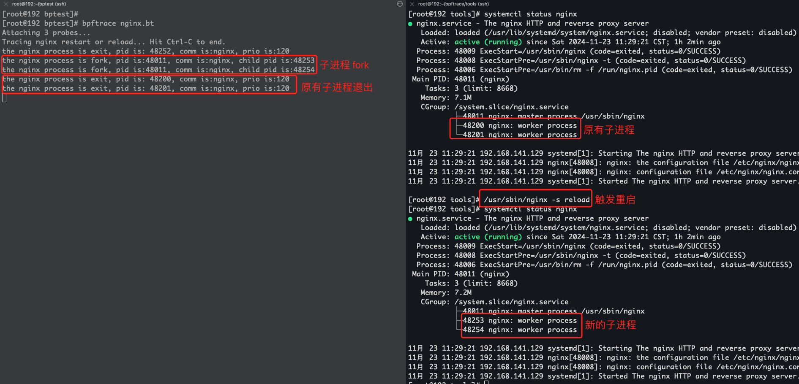

# {{ title }}

This article was written by {{ author }} on {{ date }}.

<!-- Your content starts here -->

在阅读这篇文章之前，想先问大家一个技术问题: 如果监控进程的重启操作？比如我想通过监控下 nginx 的进程是否发生了重启，是否发生了 reload 操作？对于这类问题的思路有很多，比如:
1. 监控进程的 pid 变化情况
2. 通过监控系统日志等来判断进程的变化情况。
3. ...

当然我们这里不讨论这些方法的优劣。我们不妨换个新的思路设想一下，进程的启停都会在内核中进行操作，假如说我们能够捕获到内核中的进程停止操作以及进程启动操作，类似于在内核中做一个 hook，当内核执行的时候自动触发，那我们是不是就能够直接获取到呢？带着这个疑问，我们来开始展开今天的文章。

# bpftrace 概述

我们先看下bpftrace 官方的介绍(https://github.com/bpftrace/bpftrace):
```
bpftrace is a high-level tracing language for Linux. bpftrace uses LLVM as a backend to compile scripts to eBPF-bytecode and makes use of libbpf and bcc for interacting with the Linux BPF subsystem, as well as existing Linux tracing capabilities: kernel dynamic tracing (kprobes), user-level dynamic tracing (uprobes), tracepoints, etc. The bpftrace language is inspired by awk, C, and predecessor tracers such as DTrace and SystemTap. 
```
简单来说，bpftrace 是一个基于 eBPF（Extended Berkeley Packet Filter）的高层次性能调试和故障排查工具。它通过提供简洁的脚本语言，简化了 eBPF 程序的编写，使开发者和系统管理员能够方便地监控系统行为、分析性能问题，以及调试应用程序。

## 特点

1. 强大的动态追踪能力：
   - bpftrace利用eBPF技术，能够在不修改内核代码的情况下，实现对内核和应用程序的深度监控。
   - 它集成了多种Linux追踪功能，如内核动态追踪（kprobes）、用户级动态追踪（uprobes）和tracepoints等，满足不同的追踪需求。
1. 高效的性能：
   - bpftrace使用了eBPF技术来收集和处理跟踪数据，对系统性能的影响较小。
   - 它通过LLVM作为后端编译器，将脚本编译为高效的BPF字节码，确保代码运行时的性能。
2. 简洁而强大的脚本语言：
   - bpftrace的脚本语言设计简洁而强大，支持复杂的追踪逻辑和数据聚合。
   - 它的语言设计灵感来源于awk、C语言以及如DTrace和SystemTap等先前的追踪工具，易于理解和编写。
3. 丰富的内置功能：
   - bpftrace内置了许多实用的功能，如定时采样、直方图统计、聚合计数、调用栈跟踪等，可以轻松处理各种常见的跟踪需求。
   - 它还支持条件过滤、聚合统计、函数调用、打印输出等操作，使得追踪和分析更加灵活和强大。
4. 广泛的应用场景：
   - bpftrace适用于性能监控、故障诊断、安全审计、开发调试等多种场景。
   - 它可以实时监控系统调用、磁盘I/O、网络活动等，帮助开发者快速定位性能瓶颈和故障点。
5. 可扩展性：
   - bpftrace支持借助eBPF技术进行动态追踪和事件捕获，这意味着它可以根据需要自定义和开发更高级的跟踪功能。


# bpftrace 安装

现在很多的 linux 发行版已经内置了 bpftrace 模块，在安装前可以确定下是否已经内置:
```bash
[root@192 ~]# bpftrace -V
bpftrace v0.12.1
```
如果没有安装，那么需要手动安装，这里以 centos 为例进行安装,在安装前需要确定操作系统内核: 官方建议升级到 Linux4.9以及更高的内核，下面是内核版本迭代过程中增加的功能:
- 4.1 - kprobes
- 4.3 - uprobes
- 4.6 - stack traces, count and hist builtins (use PERCPU maps for accuracy and efficiency)
- 4.7 - tracepoints
- 4.9 - timers/profiling

## yum 安装

根据官方提供的方法（https://github.com/fbs/el7-bpf-specs/blob/master/README.md#repository），通过 yum 进行安装
```bash
curl https://repos.baslab.org/rhel/7/bpftools/bpftools.repo --output /etc/yum.repos.d/bpftools.repo
yum install bpftrace bpftrace-tools bpftrace-doc bcc-static bcc-tools
```
但是这个页面搜了下是 404 的，给的链接不靠谱。

在测试的过程中，我是安装了 centos8 进行操作的，实际操作过程中使用了阿里云的 yum 源
```
[root@192 ~]# cd /etc/yum.repos.d
[root@192 ~]# wget https://mirrors.aliyun.com/repo/Centos-8.repo
[root@192 ~]# yum clean all
[root@192 ~]# yum makecache
[root@192 ~]# yum install -y bpftrace
```

## 编译安装

编译安装，首先 clone 下bpftrace 的代码，进行操作
```bash
git clone git@github.com:bpftrace/bpftrace.git
cd bpftrace
```
进入之后，可以看到提供了编译脚本,因为 bpftrace 支持基于docker 进行编译，所以直接使用 docker 编译更为方便些，在编译前需要提前安装 docker
```bash
yum install -y docker-ce docker-cli
```
在实际测试过程中，我是以`0.11.1`分支为基础进行编译的:
```bash
[root@192 bpftrace]# git status
头指针分离于 v0.11.1
[root@192 bpftrace]./build.sh
```
等待编译完成后，生成的可执行程序位于`./build-release/src/bpftrace`下，查看编译后的版本情况:
```bash
[root@192 bpftrace]# ./build-release/src/bpftrace -V
bpftrace v0.11.1-dirty
```
由于编译环境操作系统的差异，编译过程中可能会遇到各种问题，大家请自行解决;不过还是建议大家通过 yum 的形式进行安装

# 使用说明

## 核心概念

### 探针 Probes

探针是 bpftrace 的核心，用于定义事件触发，类似于事件的监控点，下面是bpftrace 提供的一些探针类型：


| 探针类型       | 描述                                                                                                   |
| --------------- | ----------------------------------------------------------------------------------------------------|
| **kprobe**      | 跟踪内核函数的入口点，监视内核函数调用。例如：`kprobe:sys_read`。                                           |
| **kretprobe**   | 跟踪内核函数的返回点，监视内核函数调用的返回值。例如：`kretprobe:sys_read`。                                  |
| **uprobe**      | 跟踪用户空间程序的入口点，监视用户进程中的函数调用。例如：`uprobe:/bin/bash:readline`。                       |
| **uretprobe**   | 跟踪用户空间程序的返回点，监视用户进程函数的返回值。例如：`uretprobe:/bin/bash:readline`。                    |
| **tracepoint**  | 监控内核中定义的静态跟踪点，提供更稳定的接口。例如：`tracepoint:syscalls:sys_enter_read`。                   |
| **usdt**        | 跟踪用户空间定义的静态探针（User-level Statically Defined Tracing）。例如：`usdt:/bin/bash:probe_name`。    |
| **software**    | 跟踪软件事件，如上下文切换（`software:context_switches`）。                                               |
| **hardware**    | 跟踪硬件事件，如 CPU 周期或指令计数（`hardware:cpu_cycles`）。                                             |
| **profile**     | 定期采样的探针，用于分析程序的性能或热点（`profile:hz:100` 每秒触发 100 次）。                                |
| **interval**    | 按固定时间间隔触发的探针，通常用于周期性报告数据（`interval:s:1` 每秒触发一次）。                               |
| **BEGIN/END**   | bpftrace 脚本的特殊探针：`BEGIN` 在脚本启动时触发，`END` 在脚本结束时触发。                                  |

### 方法列表

| **函数名**                   | **描述**                                                 | **同步/异步/编译时**          |
|-------------------------------|----------------------------------------------------------|--------------------------|
| `bswap(uint8\16\32\64 n)`   | 反转字节顺序                                              | 同步                       |
| `buf(void *d [, int length])` | 返回指针 `d` 指向的数据的十六进制格式字符串                  | 同步                        |
| `cat(char *filename)`         | 打印文件内容                                              | 异步                     |
| `cgroupid(char *path)`        | 解析 CGroup ID                                           | 编译时                   |
| `cgroup_path(int cgroupid, string filter)` | 将 CGroup ID 转换为 CGroup 路径                   | 同步                  |
| `exit([int code])`            | 退出 bpftrace，支持可选退出码                             | 异步                          |
| `join(char *arr[] [, char *delim])` | 打印数组                                               | 异步                          |
| `kaddr(char *name)`           | 解析内核符号名                                             | 编译时                        |
| `kptr(void *p)`               | 将指针标记为内核空间指针                                     | 同步                          |
| `kstack([StackMode mode, ][int level])` | 获取内核调用栈                                        | 同步                          |
| `ksym(void *p)`               | 解析内核地址                                              | 异步                          |
| `macaddr(char[6] addr)`       | 转换 MAC 地址数据                                         | 同步                          |
| `nsecs([TimestampMode mode])` | 获取时间戳或时间差                                         | 同步                          |
| `ntop([int af, ]int\|char[4\|16] addr)` | 将 IP 地址数据转换为文本                                | 同步                          |
| `offsetof(struct, element)`   | 获取结构中元素的偏移量                                      | 编译时                        |
| `override(u64 rc)`            | 覆盖返回值                                               | 同步                          |
| `path(struct path *path [, int32 size])` | 返回完整路径                                           | 同步                          |
| `percpu_kaddr(const string name [, int cpu])` | 解析 per-CPU 内核符号名                              | 同步                          |
| `print(...)`                  | 打印非 map 类型的值，使用默认格式                          | 异步                          |
| `printf(char *fmt, ...)`      | 格式化打印                                               | 异步                          |
| `pton(const string *addr)`    | 将文本 IP 地址转换为字节数组                                | 编译时                        |
| `reg(char *name)`             | 返回指定寄存器中的值                                       | 同步                          |
| `signal(char[] signal \| u32 signal)` | 向当前进程发送信号                                       | 同步                   |
| `sizeof(...)`                 | 返回类型或表达式的大小                                     | 同步                          |
| `skboutput(const string p, struct sk_buff *s, ...)` | 将 `skb` 的数据部分写入 PCAP 文件                   | 异步          |
| `str(char *s [, int length])` | 返回指针 `s` 指向的字符串                                   | 同步                          |
| `strcontains(const char *haystack, const char *needle)` | 判断字符串 `haystack` 是否包含字符串 `needle`         | 同步    |
| `strerror(uint64 error)`      | 根据 errno 返回错误信息                                     | 同步                          |
| `strftime(char *format, int nsecs)` | 返回格式化的时间戳                                      | 异步                          |
| `strncmp(char *s1, char *s2, int length)` | 比较两个字符串的前 `n` 个字符                          | 同步                          |
| `system(char *fmt)`           | 执行 Shell 命令                                          | 异步                          |
| `time(char *fmt)`             | 打印格式化时间                                            | 异步                          |
| `uaddr(char *name)`           | 解析用户态符号名                                           | 编译时                        |
| `uptr(void *p)`               | 将指针标记为用户空间指针                                     | 同步                          |
| `ustack([StackMode mode, ][int level])` | 获取用户态调用栈                                        | 同步                          |
| `usym(void *p)`               | 解析用户空间地址                                           | 异步                          |

### 内置变量
内置变量是语言中内置的特殊变量。与暂存和映射变量不同，它们不需要 $ 或 @ 作为前缀（位置参数除外）。 “Kernel”列指示所需的最低内核版本，“BPF Helper”列指示用于此内置函数的原始 BPF 帮助器函数。

| **变量名**                 | **类型**          | **Kernel** | **BPF Helper**              | **描述**                                                                                                      |
|----------------------------|-------------------|--------------|-----------------------------|--------------------------------------------------------------------------------------------------------------|
| `$1, $2, …​$n`             | `int64`          | n/a          | n/a                         | 传递给 bpftrace 程序的第 n 个位置参数。如果传递的参数少于 n，则值为 0。对于字符串参数，使用 `str()` 调用获取值。       |
| `$#`                       | `int64`          | n/a          | n/a                         | 传递的总位置参数数量。                                                                                        |
| `arg0, arg1, …​argn`       | `int64`          | n/a          | n/a                         | 被跟踪函数的第 n 个参数。这些参数从 CPU 寄存器中提取。寄存器中传递的参数数量取决于 CPU 架构（适用于 kprobes、uprobes、usdt）。|
| `args`                     | `struct args`    | n/a          | n/a                         | 跟踪函数的所有参数结构体。在 tracepoint、fentry、fexit 和带有 DWARF 的 uprobe 探针中可用。使用 `args.x` 访问参数 x，或使用 `args` 获取包含所有参数的结构体。|
| `cgroup`                   | `uint64`         | 4.18         | `get_current_cgroup_id`     | 当前进程所属的 cgroup ID，仅适用于 cgroupv2。                                                                |
| `comm`                     | `string[16]`     | 4.2          | `get_current_comm`          | 当前线程的名称。                                                                                              |
| `cpid`                     | `uint32`         | n/a          | n/a                         | 如果使用 `-c` 选项调用 bpftrace，则为子进程 ID。                                                              |
| `cpu`                      | `uint32`         | 4.1          | `raw_smp_processor_id`      | 正在执行 BPF 程序的处理器 ID。                                                                                |
| `curtask`                  | `uint64`         | 4.8          | `get_current_task`          | 指向当前任务的 `struct task_struct` 指针。                                                                    |
| `elapsed`                  | `uint64`         | (见 nsec)    | `ktime_get_ns / ktime_get_boot_ns` | 自 bpftrace 初始化以来经过的纳秒数，基于 nsecs。                                                              |
| `func`                     | `string`         | n/a          | n/a                         | 当前被跟踪函数的名称（适用于 kprobes 和 uprobes）。                                                           |
| `gid`                      | `uint64`         | 4.2          | `get_current_uid_gid`       | 当前线程的组 ID（以初始命名空间视角）。                                                                       |
| `jiffies`                  | `uint64`         | 5.9          | `get_jiffies_64`            | 内核的 jiffies。在 32 位系统中，使用该内置变量可能较慢。                                                       |
| `numaid`                   | `uint32`         | 5.8          | `numa_node_id`              | 执行 BPF 程序的 NUMA 节点 ID。                                                                                |
| `pid`                      | `uint32`         | 4.2          | `get_current_pid_tgid`      | 当前线程的进程 ID（即线程组 ID），以初始命名空间视角。                                                         |
| `probe`                    | `string`         | n/a          | n/a                         | 当前探针的名称。                                                                                              |
| `rand`                     | `uint32`         | 4.1          | `get_prandom_u32`           | 随机数。                                                                                                     |
| `return`                   | n/a              | n/a          | n/a                         | `return` 关键字用于退出当前探针，与 `exit()` 不同，它不会退出 bpftrace。                                       |
| `retval`                   | `int64`          | n/a          | n/a                         | 被跟踪函数的返回值（适用于 kretprobe、uretprobe、fexit）。                                                     |
| `tid`                      | `uint32`         | 4.2          | `get_current_pid_tgid`      | 当前线程的线程 ID，以初始命名空间视角。                                                                        |
| `uid`                      | `uint64`         | 4.2          | `get_current_uid_gid`       | 当前线程的用户 ID，以初始命名空间视角。                                                                        |

## 命令帮助

在使用前，我们先查看下 bpftrace 命令的帮助(用 `man bpftrace` 可以看到更全的信息):
```bash
[root@192 ~]# bpftrace -h
USAGE:
    bpftrace [options] filename
    bpftrace [options] - <stdin input>
    bpftrace [options] -e 'program'

OPTIONS:
    -B MODE        output buffering mode ('full', 'none')
    -f FORMAT      output format ('text', 'json')
    -o file        redirect bpftrace output to file
    -d             debug info dry run
    -dd            verbose debug info dry run
    -e 'program'   execute this program
    -h, --help     show this help message
    -I DIR         add the directory to the include search path
    --include FILE add an #include file before preprocessing
    -l [search]    list probes
    -p PID         enable USDT probes on PID
    -c 'CMD'       run CMD and enable USDT probes on resulting process
    --usdt-file-activation
                   activate usdt semaphores based on file path
    --unsafe       allow unsafe builtin functions
    -q             keep messages quiet
    -v             verbose messages
    --info         Print information about kernel BPF support
    -k             emit a warning when a bpf helper returns an error (except read functions)
    -kk            check all bpf helper functions
    -V, --version  bpftrace version
    --no-warnings  disable all warning messages
```
部分参数说明:
1. -B MODE 设置标准输出的缓冲模式:
  - none:无缓冲，每个 IO 尽快写入
  - full:一旦缓冲区已满，数据就会被写入
  - line:数据在第一个换行符处或缓冲区已满时写入。line是默认的缓冲模式
2. -c COMMAND: 作为子进程运行 COMMAND。当子进程终止时，bpftrace 也将会终止，就像调用了“exit()”一样。如果 bpftrace 在子进程之前终止，则子进程将通过 SIGTERM 终止。
3. -e PROGRAM: 执行 PROGRAM
4. -l:列出所有探针
```
[root@192 ~]# bpftrace -l | grep  tracepoint:raw_syscalls:*
tracepoint:raw_syscalls:sys_enter
tracepoint:raw_syscalls:sys_exit
```


## 语法

其基础语法如下:
```bash
probe[,probe,...] /filter/ { action }
```
- 探针指定要检测的事件类型，bpftrace 定义了多种类型的探针；
- 过滤器是可选的，可以根据布尔表达式进行过滤，
- action 是运行的程序

我们先以`hello world`做一个入门的示例:
```
[root@192 ~]# bpftrace -e 'BEGIN { printf("Hello Bpftrace!\n");}'
Attaching 1 probe...
Hello Bpftrace!
```
这里的探针probe 类型是 `BEGIN`,即在 bpftrace 脚本启动时，BEGIN 探针通过`printf`函数输出`Hello Bpftrace!`

### 过滤器
我们再上一个例子,使用 kretprobe 来检测docker进程 sys_read 函数的返回，这里我们要筛选出 docker 进程，就可以使用过滤器进行过滤,在知道进程号的情况下，可以直接使用 `pid==`:
```bash
[root@192 bpftrace]# bpftrace -e 'kretprobe:vfs_read /pid == 41981/ { @bytes = hist(retval); }'
Attaching 1 probe...
^C
@bytes:
[1]                  329 |@@@@@@@@@@@@@@@@@@@@@@@@@@@@@@@@@@@@@@@@@@@@@@@@@@@@|
```
- 这里的`kretprobe`是内核探针，会在内核函数`vfs_read`返回时触发，捕获返回值。
- `pid == 41981`条件过滤器，只处理该进程的返回
- `@bytes = hist(retval);`:@bytes 是一个 bpftrace 的全局变量（名称可以自行定义），类型为直方图（hist）;hist(retval) 将记录函数 vfs_read 返回值（retval）的分布情况;retval 是 vfs_read 函数返回的值，即读取到的字节数。
  
这里完整的执行逻辑是:
1. 当内核函数 vfs_read 被调用并完成返回时: kretprobe:vfs_read 会触发探针并且捕获到函数的返回值
2. 如果触发探针的进程 pid 是 41981，将返回值添加到 @bytes 的直方图中，直方图会记录返回值的分布情况（即不同大小的读取字节数）。
3. 如果进程 id 不是 41981，则直接跳过

当然，我们也可以直接通过进程名称的形式去过滤:
```bash
bpftrace -e 'kretprobe:vfs_read /comm == "dockerd" / { @bytestest = hist(retval); printf("pid:%d, comm:%s\n", pid, comm); }'
```

### 运算符

bpftrace 支持以下运算符:

1. 算数运算符:`+, -, *, /, %`
2. 逻辑运算符:`&&,||,!`
3. 按位运算符:`&,|,^,<<,>>`
4. 关系运算符:`<,<=,>,>=,==,!=`
5. 赋值运算符:`=,<<=,>>=,+=,-=,*=,/=,%=,&=,|=,^=`

再次基于上述的案例进行一下操作:
```bash
[root@192 bpftrace]#  bpftrace -e 'kretprobe:vfs_read /comm == "/usr/bin/dockerd" && comm != "sshd" / { @bytestest = hist(retval); printf("pid:%d, comm:%s\n", pid, comm); }'
Attaching 1 probe...
pid:41981, comm:dockerd
pid:41981, comm:dockerd
pid:1114, comm:in:imjournal
pid:39225, comm:containerd
pid:1114, comm:in:imjournal
```

### 结构体
在 bpftrace 中，结构体主要用于访问特定内核事件（如 tracepoints 或 uprobes）中提供的复杂数据类型。**结构体**是 BPF 内核事件的一个核心概念，它允许用户访问和解析事件中嵌套的字段。bpftrace 自动解析许多内核提供的结构体字段，尤其是在支持 BTF（BPF Type Format）时。在使用过程中，可以使用 -> 运算符访问指向结构的指针的字段。

访问字段的语法:`args->field_name`,其中:
- args：bpftrace 自动提供的结构体指针（如 tracepoints 和 usdt 中的 args）。
- field_name：结构体中的字段名称。

比如说想监控一下文件系统的 open 事件并且打印文件名，进程号等,涉及到的探针是`tracepoint:syscalls:sys_enter_openat`,我们首先看下这个探针的详细类型:
```bash
[root@192 bpftrace]# bpftrace -lv tracepoint:syscalls:sys_enter_openat
tracepoint:syscalls:sys_enter_openat
    int __syscall_nr
    int dfd
    const char * filename
    int flags
    umode_t mode
```
可以看到相关的结构体信息，其中包含了 filename,假如说监控打开了 build.sh的进程信息:
```bash
[root@192 bpftrace]# bpftrace -e 'tracepoint:syscalls:sys_enter_openat /str(args->filename) == "build.sh"/ { printf("File: %s, pid:%d\n", str(args->filename), pid); }'
Attaching 1 probe...
File: build.sh, pid:46102
File: build.sh, pid:46102
```

此外，bpftrace 还支持自定义结构体。我们后续详细展开

### 条件语句
bpftrace 的条件语句目前只支持 if/else 暂时不支持 else if 类型操作。通过一个例子来模拟一下,假如说我们需要查看 kill 信号的触发进程:
```bash
[root@192 bpftrace]# bpftrace -e 'tracepoint:syscalls:sys_enter_kill { if (pid > 1) {printf("pid:%d\n", pid)} else { printf("pid is 1\n")}} '
Attaching 1 probe...

pid:1509
pid is 1
pid is 1
```
这里定义使用了tracepoint:syscalls:sys_enter_kill，用于在执行 kill系统调用的入口处触发,当触发的进程 >1,输出`pid:进程号`，其他情况下输出`pid is 1`。

当然我们也可以扩展为一个脚本，在 kill 进入时输出，在退出时也输出, bpftrace的脚本以.bt为后缀，然后通过`bpftrace xxx.bt`运行:
```shell
#!/usr/bin/env bpftrace

BEGIN
{
    printf("Tracing sys_kill... Hit Ctrl-C to end.\n");
}

tracepoint:syscalls:sys_enter_kill
{
    if (pid > 1) {
        printf("enter kill,pid is:%d, comm is:%s\n", pid, comm)
    } else {
        printf("enter kill,pid is 1, comm is:%s\n", comm)
    }
}

tracepoint:syscalls:sys_exit_kill
{
    if (pid > 1) {
        printf("exit kill,pid is:%d, comm is:%s\n", pid, comm)
    } else {
        printf("exit kill,pid is 1, comm is:%s\n", comm)
    }
}
```

### 循环语句

在 bpftrace 语句中，支持 unroll、 while 和 for 循环（while 循环在内核 5.3 版本开始进行支持，参考:https://github.com/bpftrace/bpftrace/issues/872, 而 for 循环在 5.13 以及更高版本支持）

unroll 是 bpftrace 提供的用于模拟循环的功能，适合静态固定次数的循环。我们先看下 unroll 的用法:
```bash
[root@192 bptest]# bpftrace -e '                                                          BEGIN {
    unroll(10) {
        printf("pid: %d\n", pid);
    }
}'
```
这里做循环的 10 次输出 pid 信息。

我们在看下`while`的用法，在使用 while 的时候，我们可以轻松联想到对应支持 `break、continue、return` 等。
```bash
bpftrace -e 'i:ms:100 { $i = 0; while ($i <= 100) { if ($i > 50) { break; } printf("%d ", $i); $i++} exit(); }'
```
也可以看到这里的语法**支持自增**等操作。

for循环可用于迭代隐射中的元素:
```bash
for ($kv : @map) {
  block;
}
```

### 数组和元组

数组是一组数据的集合。我们可以直接看一个例子:
```bash
bpftrace -e '
BEGIN {
    // 使用 Map 模拟数组
    @my_array[0] = 10;
    @my_array[1] = 20;
    @my_array[2] = 30;

    // 打印数组元素
    printf("Array elements: %d, %d, %d\n", @my_array[0], @my_array[1], @my_array[2]);
}
'
```
元组是一种序列类型（如数组），与数组不同，每个元素可以有不同的类型。
```
[root@192 bptest]# bpftrace -e '
i:s:1 {
  $a = (1,2);
  $b = (3,4, $a);
  print($a);
  print($b);
  print($b.0);
}'
```
至于其他的语法规则，这里不再展开，大家自行查阅官网文档即可。

# 回到开头

那我们现在再来回顾文章开头提到的问题，既然 bpftrace 能够跟踪到内核，那么肯定也可以跟踪到进程的启停操作，我们以`nginx -s reload`为例分析下，在 nginx 发生 reload 的时候首先会创建新的子进程,子进程创建完毕之后，会让旧进程退出。这里就需要监控到两个地方:
1. fork子进程操作
2. 子进程退出操作

bpftrace 中有 tracepoint:sched类的探针来探测这些行为，这里提供下脚本:
```bash
#!/usr/bin/env bpftrace

BEGIN
{
    printf("Tracing nginx restart or reload... Hit Ctrl-C to end.\n");
}

tracepoint:sched:sched_process_exit
/ comm == "nginx" /
{
    printf("the nginx process is exit, pid is: %d, comm is:%s, prio is:%d\n", pid, comm, args->prio)
}

tracepoint:sched:sched_process_fork
/ comm == "nginx" /
{
   printf("the nginx process is fork, pid is:%d, comm is:%s, child pid is:%d\n", pid, comm, args->child_pid)
}
```
我们看下效果:

从图中可以清晰的看到了 reload 操作被成功地捕获。

这篇文章中，大概展示了下 bpftrace 的相关概念和语法以及基本的操作，而在实际监控场景中，监控的指标多种多样，后续会通过一些典型场景来看看如果使用 bpftrace 进行监控。

# 声明

码字不易，希望文章对各位读者朋友们有所帮助和启发，文章的撰写有的时候是根据自己的经验和遇到的一些场景所思考的，存在不足和错误的地方，希望读者朋友们指正。转载请声明来源

