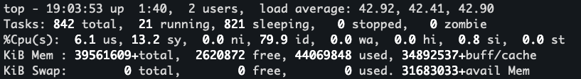
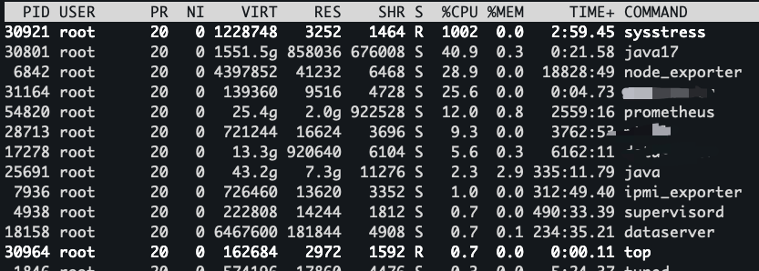
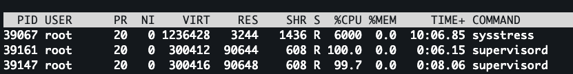
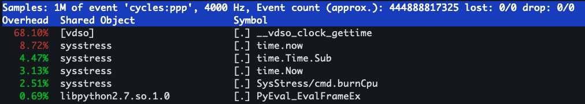

# 线上常见问题排查

在很多文章中，每当提到去解决线上问题的时候，大部分的处理方式就是登录环境，哐哐各种敲命令。操作本身没什么问题，但是对于很多人而言，我觉得这种做法其实是本末倒置的，过于在乎去快速抓住重点问题，而忽略了从全局去看问题。那么如果最开始不去操作各种命令，那应该干什么呢？

***看监控！！！！***

首先不要觉得这个是废话，对于很多场景来说，业务规模是不断变化的，有的时候并发超过了极限的性能，那么这种情况下都没有必要去后台进行各种查询。举个简单的例子，假如说某套业务系统，本身只能支持 500 并发，现在实际上的量到了 2000，导致线上各种内存、CPU、负载的告警，这种情况下还有必要去后台敲`top`、`free`吗？答案当然是否定的，这种情况下，就需要考虑对业务系统进行快速的扩容等。

看监控的意义在于尽可能的找到更多的性能瓶颈或者异常的点，从全局出发，对系统当前存在的问题和异常点有全面的了解。

监控系统多种多样，从较早的 zabbix 到现在比较流行的prometheus+grafana（举两个常用的例子），对于系统业务都有比较完善的监控，可以帮助我们更加具体的了解到系统运行全貌。如果你对这些都不喜欢，那么你自己写一个监控系统也没什么问题。

当我们看完监控之后（假设你真的看了），接下来进入实际操作环节，我会从这些指标的详细含义出发，然后尽可能地将各种处理方式分享给大家。

## CPU使用率飙升

### 如何让CPU使用率飙升

这个问题其实很简单，只要有计算任务一直存在，让 CPU 一直处于繁忙之中，那么 CPU 必然飙升。我们可以通过一系列的工具去模拟这个情况。

[github SysStress](https://github.com/baixiaozhou/SysStress) 这是我自己用 golang 写的压测工具(还在开发中，可以点个 star 让我更有动力😂)

使用方法:
```
./sysstress cpu --cpu-number 10 --duration 10m
```
这个就是模拟占用 10 核心的 CPU 并持续 10min，当然大家也可以用其他的压测工具，比如`stress-ng`

### 如何判断和发现CPU使用率飙升

首先我们先看一下，跟 CPU 使用率相关的有哪些指标。我们通过 `top` 命令就可以看到具体的信息


这些输出中有一行是 `%Cpu(s)`, 这行展示了 CPU 的整体使用情况，是一个百分比的形式，我们详细阐述下这几个字段的含义
```
us, user    : time running un-niced user processes   未降低优先级的用户进程所占用的时间
sy, system  : time running kernel processes          内核进程所占用的时间
ni, nice    : time running niced user processes      降低优先级的用户进程所占用的时间
id, idle    : time spent in the kernel idle handler  空闲的时间
wa, IO-wait : time waiting for I/O completion        等待 I/O 操作完成所花费的时间
hi : time spent servicing hardware interrupts        处理硬件中断所花费的时间
si : time spent servicing software interrupts        处理软件中断所花费的时间
st : time stolen from this vm by the hypervisor      被虚拟机管理程序从此虚拟机中窃取的时间
```
在这些指标中，一般关注的比较多的就是 us、sy、id、wa（其他几个指标很高的情况我个人目前基本上没有遇到过）

上述指标反映了系统整体的 CPU 情况。而程序在操作系统中实际上是以一个个的进程存在的，那我们如何确定到占用 CPU 高的进程呢？让我们的目光从 top 的头部信息往下移动，下面就展示了详细的进程信息


这些程序默认是按照 CPU 的使用率从高到底进行排序的，当然你也可以通过在`top`的时候输入`P`进行排序，这样我们就可以看到系统中消耗 CPU 资源的详细进程信息

上面是我通过 `./sysstress cpu --cpu-number 10 --duration 10m` 压测程序跑出来的，可以看到这里的 sysstress 程序占用了 1002 的 %CPU，也就是说基本上是 10 个核心，那我们跑一个更高的，将`--cpu-number`加到 60 看看发生了什么


我们可以看到这次%CPU打到了 6000，那很多人就好奇我日常的程序跑到多高算高呢？

这里我们需要明确一点，现在的服务器绝大部分都是多核心 CPU（1C2G这种自己用来玩的忽略），CPU 的核心数决定了我们程序在同一时间能够执行多少个线程，也就是说，这个高不高是相对于机器配置而言的。如果你的机器只有 16C，那么单个进程占用的 %CPU 到 1000，那么其实已经算是比较高了。如果是 256C 的CPU（土豪级配置），那么单个进程占用的 %CPU 到 6000，对于系统的稳定性影响就没有那么大了。

上述我们说的情况是进程占用 CPU 对整个系统的影响，那么进程占用的 CPU 对系统的影响不大就代表这个程序一定没有问题吗？答案显然是未必的。

我们还是要回归到业务本身，如果进程的 CPU 占用在业务变动不大的情况下，发生了异常波动，或者正常情况下业务不会消耗这么高的 CPU，那么我们就需要继续排查了。

### 如何确定CPU飙升的根源
这个问题的 核心是 CPU 上在运行什么东西。 多核心CPU 下，每个核心都可以执行不同的程序，我们如何确定一个进程中那些方法在消耗 CPU 呢？从而引申下面详细的问题:
 1. 程序的调用栈是什么样的？
 2. 调用栈信息中哪些是需要关注的，那些是可以忽略的？
 3. 热点函数是什么？

老话说得好，"工欲善其事，必先利其器", 我们需要这些东西，就必须了解到什么样的工具可以拿到上面我提到的一些信息。接下来我将通过常用的后端语言：`golang` 和 `java` 为例构造一些高 CPU 的程序来进行展示。

#### perf命令
**perf是一款Linux性能分析工具。Linux性能计数器是一个新的基于内核的子系统，它提供一个性能分析框架，比如硬件（CPU、PMU(Performance Monitoring Unit)）功能和软件(软件计数器、tracepoint)功能。**

安装:
```
yum install perf   #Centos
```
安装完成后，我们可以首先看下 `perf`的用法，这里不展开具体用法，只列出我平常使用的几个命令:
```
top        System profiling tool.               #对系统性能进行实时分析。
record     Run a command and record its profile into perf.data     #收集采样信息
report     Read perf.data (created by perf record) and display the profile  #分析采样信息，和record配合使用
```
record 和 report 的使用更多在于 dump 当前环境的信息用于后续分析，如果在自己环境上测试，可以用 top 进行一些简单的实时分析（类似于 top 命令）。

还是用之前的压测工具，我们模拟一个 10 核心的 10min 的压测场景
```
nohup ./sysstress cpu --cpu-number 10 --duration 10m > /dev/null 2>&1 &
```
执行这个语句，让压测程序在后台执行，然后我们通过`perf top`查看具体的情况



从截图的信息中我们可以看到占用资源最多的一些方法，包括 sysstress 进程的各种方法以及底层的 `__vdso_clock_gettime`, 那再结合压测工具的代码分析下:

``` golang
func burnCpu(wg *sync.WaitGroup, start time.Time, durSec int64) {
	defer wg.Done()
	for {
		_ = 1 * 1
		now := time.Now()
		if now.Sub(start) > time.Duration(durSec)*time.Second {
			break
		}
	}
}
```
这是方法的核心，其实就是做无意义的计算，外加时间的判断，超过 duration 就结束。这样和上面的 perf top 信息就能对应起来。

然后我们用 java 写一个同样的程序，再看看:

