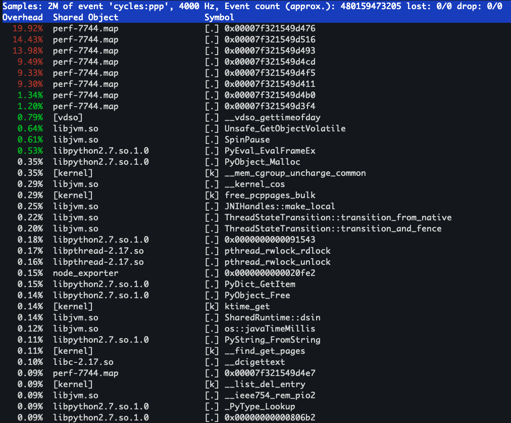
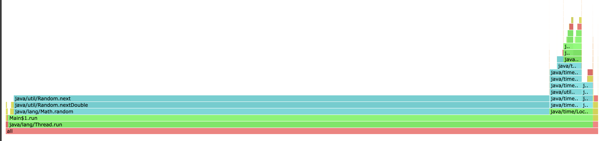
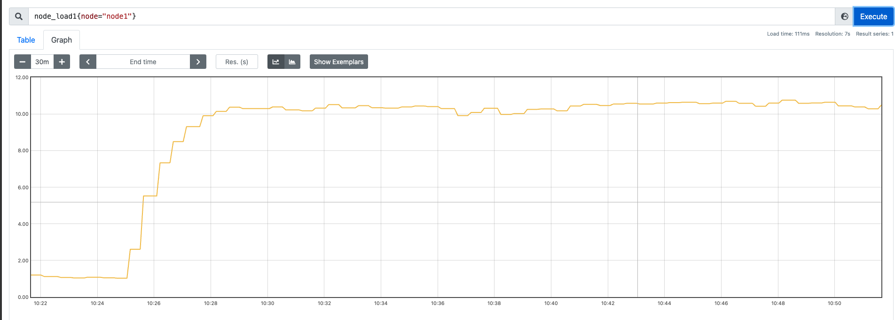
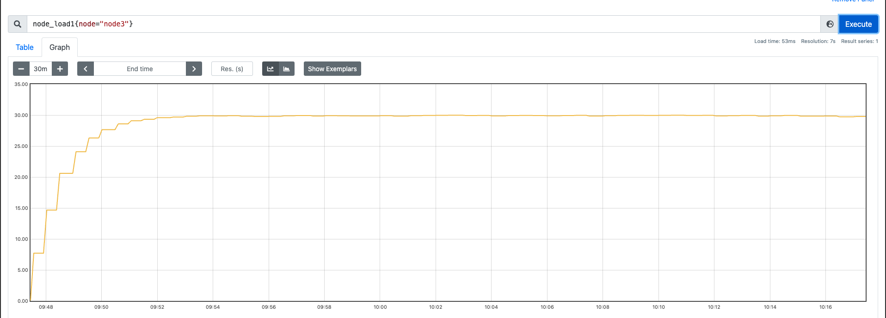
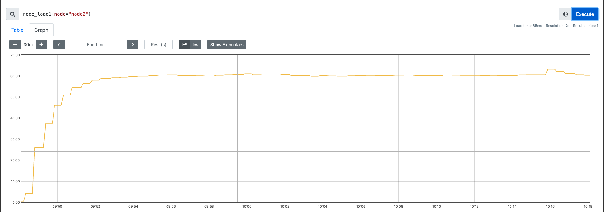

<!-- more -->



[Examining Load Average](https://www.linuxjournal.com/article/9001)
[What-is-CPU-Load-Average](https://community.tenable.com/s/article/What-is-CPU-Load-Average)
[Brendan Gregg个人网站](www.brendangregg.com)


## 写在前面

在很多文章中，每当提到去解决线上问题的时候，大部分的处理方式就是登录环境，哐哐各种敲命令。操作本身没什么问题，但是对于很多人而言，我觉得这种做法其实是本末倒置的，过于在乎去快速抓住重点问题，而忽略了从全局去看问题。那么如果最开始不去操作各种命令，那应该干什么呢？

***看监控！！！！***

首先不要觉得这个是废话，对于很多场景来说，业务规模是不断变化的，有的时候并发超过了极限的性能，那么这种情况下都没有必要去后台进行各种查询。举个简单的例子，假如说某套业务系统，本身只能支持 500 并发，现在实际上的量到了 2000，导致线上各种内存、CPU、负载的告警，这种情况下还有必要去后台敲`top`、`free`吗？答案当然是否定的，这种情况下，就需要考虑对业务系统进行快速的扩容等。

看监控的意义在于尽可能的找到更多的性能瓶颈或者异常的点，从全局出发，对系统当前存在的问题和异常点有全面的了解。

监控系统多种多样，从较早的 zabbix 到现在比较流行的prometheus+grafana（举两个常用的例子），对于系统业务都有比较完善的监控，可以帮助我们更加具体的了解到系统运行全貌。如果你对这些都不喜欢，那么你自己写一个监控系统也没什么问题。

当我们看完监控之后（假设你真的看了），接下来进入实际操作环节，我会从这些指标的详细含义出发，然后尽可能地将各种处理方式分享给大家。

## Linux性能谱图

在分析问题前，我们首先需要明确 Linux 有哪些性能分析工具，我们先上一下LINUX 性能专家 Brendan Gregg 总结的图（大家如果对性能分析等感兴趣的话，可以认真看下这位大佬的个人网站）:



上面这张图是引用大佬文章的图，原文链接在这里: https://www.brendangregg.com/linuxperf.html

## CPU使用率飙升

### 如何让CPU使用率飙升

这个问题其实很简单，只要有计算任务一直存在，让 CPU 一直处于繁忙之中，那么 CPU 必然飙升。我们可以通过一系列的工具去模拟这个情况。

[github SysStress](https://github.com/baixiaozhou/SysStress) 这是我自己用 golang 写的压测工具(还在开发中，可以点个 star 让我更有动力😂)

使用方法:
```
./sysstress cpu --cpu-number 10 --duration 10m
```
这个就是模拟占用 10 核心的 CPU 并持续 10min，当然大家也可以用其他的压测工具，比如`stress-ng`

### 如何判断和发现CPU使用率飙升

首先我们先看一下，跟 CPU 使用率相关的有哪些指标。我们通过 `top` 命令就可以看到具体的信息


<!--  -->
这些输出中有一行是 `%Cpu(s)`, 这行展示了 CPU 的整体使用情况，是一个百分比的形式，我们详细阐述下这几个字段的含义
```
us, user    : time running un-niced user processes   未降低优先级的用户进程所占用的时间
sy, system  : time running kernel processes          内核进程所占用的时间
ni, nice    : time running niced user processes      降低优先级的用户进程所占用的时间
id, idle    : time spent in the kernel idle handler  空闲的时间
wa, IO-wait : time waiting for I/O completion        等待 I/O 操作完成所花费的时间
hi : time spent servicing hardware interrupts        处理硬件中断所花费的时间
si : time spent servicing software interrupts        处理软件中断所花费的时间
st : time stolen from this vm by the hypervisor      被虚拟机管理程序从此虚拟机中窃取的时间
```
在这些指标中，一般关注的比较多的就是 us、sy、id、wa（其他几个指标很高的情况我个人目前基本上没有遇到过）

上述指标反映了系统整体的 CPU 情况。而程序在操作系统中实际上是以一个个的进程存在的，那我们如何确定到占用 CPU 高的进程呢？让我们的目光从 top 的头部信息往下移动，下面就展示了详细的进程信息

<!-- !cess](../imagescess.png) -->

这些程序默认是按照 CPU 的使用率从高到底进行排序的，当然你也可以通过在`top`的时候输入`P`进行排序，这样我们就可以看到系统中消耗 CPU 资源的详细进程信息

上面是我通过 `./sysstress cpu --cpu-number 10 --duration 10m` 压测程序跑出来的，可以看到这里的 sysstress 程序占用了 1002 的 %CPU，也就是说基本上是 10 个核心，那我们跑一个更高的，将`--cpu-number`加到 60 看看发生了什么
<!--  -->


我们可以看到这次%CPU打到了 6000，那很多人就好奇我日常的程序跑到多高算高呢？

这里我们需要明确一点，现在的服务器绝大部分都是多核心 CPU（1C2G这种自己用来玩的忽略），CPU 的核心数决定了我们程序在同一时间能够执行多少个线程，也就是说，这个高不高是相对于机器配置而言的。如果你的机器只有 16C，那么单个进程占用的 %CPU 到 1000，那么其实已经算是比较高了。如果是 256C 的CPU（土豪级配置），那么单个进程占用的 %CPU 到 6000，对于系统的稳定性影响就没有那么大了。

上述我们说的情况是进程占用 CPU 对整个系统的影响，那么进程占用的 CPU 对系统的影响不大就代表这个程序一定没有问题吗？答案显然是未必的。

我们还是要回归到业务本身，如果进程的 CPU 占用在业务变动不大的情况下，发生了异常波动，或者正常情况下业务不会消耗这么高的 CPU，那么我们就需要继续排查了。

### 如何确定CPU飙升的根源
这个问题的 核心是 CPU 上在运行什么东西。 多核心CPU 下，每个核心都可以执行不同的程序，我们如何确定一个进程中那些方法在消耗 CPU 呢？从而引申下面详细的问题:
 1. 程序的调用栈是什么样的？
 2. 调用栈信息中哪些是需要关注的，那些是可以忽略的？
 3. 热点函数是什么？

老话说得好，"工欲善其事，必先利其器", 我们需要这些东西，就必须了解到什么样的工具可以拿到上面我提到的一些信息。接下来我将通过常用的后端语言：`golang` 和 `java` 为例构造一些高 CPU 的程序来进行展示。

#### perf命令
**perf是一款Linux性能分析工具。Linux性能计数器是一个新的基于内核的子系统，它提供一个性能分析框架，比如硬件（CPU、PMU(Performance Monitoring Unit)）功能和软件(软件计数器、tracepoint)功能。**

安装:
```
yum install perf   #Centos
```
安装完成后，我们可以首先看下 `perf`的用法，这里不展开具体用法，只列出我平常使用的几个命令:
```
top        System profiling tool.               #对系统性能进行实时分析。
record     Run a command and record its profile into perf.data     #收集采样信息
report     Read perf.data (created by perf record) and display the profile  #分析采样信息，和record配合使用
```
record 和 report 的使用更多在于 dump 当前环境的信息用于后续分析，如果在自己环境上测试，可以用 top 进行一些简单的实时分析（类似于 top 命令）。

还是用之前的压测工具，我们模拟一个 10 核心的 10min 的压测场景
```
nohup ./sysstress cpu --cpu-number 10 --duration 10m > /dev/null 2>&1 &
```
执行这个语句，让压测程序在后台执行，然后我们通过`perf top`查看具体的情况（可以通过-p 指定 pid）


<!--  -->

从截图的信息中我们可以看到占用资源最多的一些方法，包括 sysstress 进程的各种方法(从图片中基本上就可以确定高消耗的方法在哪里)以及底层的 `__vdso_clock_gettime`, 那再结合压测工具的代码分析下:

``` golang
func burnCpu(wg *sync.WaitGroup, start time.Time, durSec int64) {
	defer wg.Done()
	for {
		_ = 1 * 1
		now := time.Now()
		if now.Sub(start) > time.Duration(durSec)*time.Second {
			break
		}
	}
}
```
这是方法的核心，其实就是做无意义的计算，外加时间的判断，超过 duration 就结束。这样和上面的 perf top 信息就能对应起来。

然后我们用 java 写一个同样的程序，再看看 `perf top`的情况:

<!--  -->
从这一大段显示来看，是不是看的一脸懵逼，很难发现到底是什么程序在占用CPU 资源。大家可以看一下源程序:
``` java
import java.time.LocalDateTime;

public class Main {
    public static void main(String[] args) {
        int n = 10;

        for (int i = 0; i < 10; i++) {
            new Thread(new Runnable() {
                public void run() {
                    while (true) {
                        Math.sin(Math.random());
                        LocalDateTime currentTime = LocalDateTime.now();
                    }
                }
            }).start();
        }
    }
}
```
这里的程序也是非常简单，启动 10 个线程，做一个无意义的数学运算，然后获取当前时间。从这段代码中是不是很难和上面`perf top`的显示关联起来？ 原因也非常简单， 像Java 这种通过 JVM 来运行的应用程序，运行堆栈用的都是 JVM 内置的函数和堆栈管理。所以，从系统层面只能看到 JVM 的函数堆栈，而不能直接得到 Java 应用程序的堆栈。那我们好能通过 perf 去看到 java 相关的堆栈吗？答案是可以的。

可以借助 [perf-map-agent](https://github.com/jvm-profiling-tools/perf-map-agent) 这样的开源工具，去生成和`perf` 工具一起使用的方法映射，但是需要做额外的一些配置。这里的方法大家可以自己探究，为什么不详细的讲这个呢，原因也简单，排查问题的工具多种多样，没必要在一棵树上吊死。

#### jstack

既然 perf top 去查看 JAVA 的调用栈不太方便，我们就直接上 java 提供的 jstack 工具去分析。
- jstack -l pid > xxx.txt 需要注意的是，linux系统中往往会用不同的用户去执行不同的程序，此时可能需要通过sudu -u xxx jstack的形式
- kill -3， jstack 用不了的情况下可以使用 kill -3 pid 的形式，堆栈默认会输出在系统日志中（根据不同的配置，信息也可能输出在其他地方，比如这个程序的日志中）。

具体的操作步骤:
1. `top -Hp $pid` 找到占用 CPU 的具体线程
2. `jstack -l $pid > /tmp/$pid.jstack` 或者 `kill -3 $pid`将 java 进程的堆栈情况输出的日志中，然后根据 `top -Hp` 看到的线程信息在输出的堆栈日志中进行查找（`top -Hp` 输出的是 10 进制的 id，`jstack` 输出的是 16 进制的，在查找时注意进制转换）

我们看下上面 java 程序的堆栈的信息:
``` Lua
2024-08-16 15:15:40
Full thread dump Java HotSpot(TM) 64-Bit Server VM (25.221-b11 mixed mode):

"Attach Listener" #35 daemon prio=9 os_prio=0 tid=0x00007f52b4001000 nid=0x71f4 waiting on condition [0x0000000000000000]
   java.lang.Thread.State: RUNNABLE

   Locked ownable synchronizers:
	- None

"DestroyJavaVM" #34 prio=5 os_prio=0 tid=0x00007f53e0009800 nid=0x1693 waiting on condition [0x0000000000000000]
   java.lang.Thread.State: RUNNABLE

   Locked ownable synchronizers:
	- None

"Thread-1" #25 prio=5 os_prio=0 tid=0x00007f53e015a800 nid=0x16d9 runnable [0x00007f52f64e3000]
   java.lang.Thread.State: RUNNABLE
	at sun.misc.Unsafe.getObjectVolatile(Native Method)
	at java.util.concurrent.ConcurrentHashMap.tabAt(ConcurrentHashMap.java:755)
	at java.util.concurrent.ConcurrentHashMap.get(ConcurrentHashMap.java:938)
	at java.time.zone.ZoneRulesProvider.getProvider(ZoneRulesProvider.java:267)
	at java.time.zone.ZoneRulesProvider.getRules(ZoneRulesProvider.java:227)
	at java.time.ZoneRegion.ofId(ZoneRegion.java:120)
	at java.time.ZoneId.of(ZoneId.java:411)
	at java.time.ZoneId.of(ZoneId.java:359)
	at java.time.ZoneId.of(ZoneId.java:315)
	at java.util.TimeZone.toZoneId(TimeZone.java:556)
	at java.time.ZoneId.systemDefault(ZoneId.java:274)
	at java.time.Clock.systemDefaultZone(Clock.java:178)
	at java.time.LocalDateTime.now(LocalDateTime.java:180)
	at Main$1.run(Main.java:12)
	at java.lang.Thread.run(Thread.java:748)

   Locked ownable synchronizers:
	- None

"Thread-0" #24 prio=5 os_prio=0 tid=0x00007f53e0159000 nid=0x16d8 runnable [0x00007f52f65e4000]
   java.lang.Thread.State: RUNNABLE
	at sun.misc.Unsafe.getObjectVolatile(Native Method)
	at java.util.concurrent.ConcurrentHashMap.tabAt(ConcurrentHashMap.java:755)
	at java.util.concurrent.ConcurrentHashMap.get(ConcurrentHashMap.java:938)
	at java.time.zone.ZoneRulesProvider.getProvider(ZoneRulesProvider.java:267)
	at java.time.zone.ZoneRulesProvider.getRules(ZoneRulesProvider.java:227)
	at java.time.ZoneRegion.ofId(ZoneRegion.java:120)
	at java.time.ZoneId.of(ZoneId.java:411)
	at java.time.ZoneId.of(ZoneId.java:359)
	at java.time.ZoneId.of(ZoneId.java:315)
	at java.util.TimeZone.toZoneId(TimeZone.java:556)
	at java.time.ZoneId.systemDefault(ZoneId.java:274)
	at java.time.Clock.systemDefaultZone(Clock.java:178)
	at java.time.LocalDateTime.now(LocalDateTime.java:180)
	at Main$1.run(Main.java:12)
	at java.lang.Thread.run(Thread.java:748)

   Locked ownable synchronizers:
	- None
 --- 10 个 thread

"Service Thread" #23 daemon prio=9 os_prio=0 tid=0x00007f53e0143800 nid=0x16d6 runnable [0x0000000000000000]
   java.lang.Thread.State: RUNNABLE

   Locked ownable synchronizers:
	- None

"C2 CompilerThread1" #6 daemon prio=9 os_prio=0 tid=0x00007f53e010e000 nid=0x16c5 waiting on condition [0x0000000000000000]
   java.lang.Thread.State: RUNNABLE

   Locked ownable synchronizers:
	- None
 --- 一大堆 C2 CompilerThread

"C2 CompilerThread0" #5 daemon prio=9 os_prio=0 tid=0x00007f53e010b000 nid=0x16c4 waiting on condition [0x0000000000000000]
   java.lang.Thread.State: RUNNABLE

   Locked ownable synchronizers:
	- None

"Signal Dispatcher" #4 daemon prio=9 os_prio=0 tid=0x00007f53e0109800 nid=0x16c3 runnable [0x0000000000000000]
   java.lang.Thread.State: RUNNABLE

   Locked ownable synchronizers:
	- None

"Finalizer" #3 daemon prio=8 os_prio=0 tid=0x00007f53e00d8800 nid=0x16c2 in Object.wait() [0x00007f52f7bfa000]
   java.lang.Thread.State: WAITING (on object monitor)
	at java.lang.Object.wait(Native Method)
	- waiting on <0x000000008021a5e8> (a java.lang.ref.ReferenceQueue$Lock)
	at java.lang.ref.ReferenceQueue.remove(ReferenceQueue.java:144)
	- locked <0x000000008021a5e8> (a java.lang.ref.ReferenceQueue$Lock)
	at java.lang.ref.ReferenceQueue.remove(ReferenceQueue.java:165)
	at java.lang.ref.Finalizer$FinalizerThread.run(Finalizer.java:216)

   Locked ownable synchronizers:
	- None

"Reference Handler" #2 daemon prio=10 os_prio=0 tid=0x00007f53e00d3800 nid=0x16c1 in Object.wait() [0x00007f52f7cfb000]
   java.lang.Thread.State: WAITING (on object monitor)
	at java.lang.Object.wait(Native Method)
	- waiting on <0x0000000080218d38> (a java.lang.ref.Reference$Lock)
	at java.lang.Object.wait(Object.java:502)
	at java.lang.ref.Reference.tryHandlePending(Reference.java:191)
	- locked <0x0000000080218d38> (a java.lang.ref.Reference$Lock)
	at java.lang.ref.Reference$ReferenceHandler.run(Reference.java:153)

   Locked ownable synchronizers:
	- None

"VM Thread" os_prio=0 tid=0x00007f53e00ca000 nid=0x16c0 runnable

"GC task thread#0 (ParallelGC)" os_prio=0 tid=0x00007f53e001f000 nid=0x1694 runnable

--- 一大堆 GC task thread

"VM Periodic Task Thread" os_prio=0 tid=0x00007f53e0146000 nid=0x16d7 waiting on condition

JNI global references: 202
```
我们通过 top -Hp 的信息就可以快速定位到 Thread-[0-9] 这几个线程，而每个线程的调用栈都是 `java.time.LocalDateTime.now`, 也说明了这个方法在不停消耗 CPU。（但是 jstack 只能捕获短时间或者瞬时的堆栈信息，没法处理长时间的，所以我们在获取时可以多打印几次或者使用其他方法）

至于 jstack 的详细用法，请参考我的另一篇博客：[java问题定位](https://baixiaozhou.github.io/2024/08/13/JAVA%E9%97%AE%E9%A2%98%E5%AE%9A%E4%BD%8D/)

除此之外，还有非常多的分析工具，pstack\gstack\strace\gdb等等，大家可以自行探索使用

#### 火焰图

上面我们介绍了很多操作的命令和方法，那么有没有一种比较直观的方式能够直接看到各种方法执行的耗时比重等情况呢？火焰图就是为了解决这种情况而生的。

火焰图的分类有很多，常用的包括:
1. CPU 火焰图 (CPU Flame Graph)
	-	描述：展示 CPU 在不同方法上的消耗情况，显示每个方法调用所占用的 CPU 时间。
	-	用途：用于分析 CPU 性能瓶颈，识别哪些方法消耗了最多的 CPU 资源。
	-	应用：Java、C++ 等多种编程语言的性能分析。
2. 内存火焰图 (Memory Flame Graph)
	- 描述：展示内存分配情况，显示每个方法调用分配的内存量。
    - 用途：用于检测内存泄漏、过度内存分配问题，帮助优化内存使用。
	- 应用：常用于分析内存密集型应用，如 Java 应用的堆内存分析。
3. I/O 火焰图 (I/O Flame Graph)
	-	描述：展示 I/O 操作的耗时情况，显示不同方法的 I/O 操作占用的时间。
	-	用途：用于分析应用程序的 I/O 性能，识别慢速或频繁的 I/O 操作。
	-	应用：数据库查询、文件系统操作、网络通信等场景的性能调优。

我们这里通过 [async-profiler](https://github.com/async-profiler/async-profiler) 对文章上面的java压测程序进行抓取(这个工具只能抓 java 的, 对于 golang 程序，可以利用 golang 提供的 pprof)

```
tar -xzf async-profiler-3.0-linux-x64.tar.gz
cd async-profiler-3.0-linux-x64/bin
./asprof -d 60 pid -f /tmp/javastress.html
```
我们用浏览器打开生成的 html 文件，可以看到如下的火焰图信息（可以在网页进行点击，查看更细节的方法）

<!--  -->

这样看起来就比 jstack这些信息更加直观一点。

## 负载飙升

### 负载的定义以及如何查看负载

我们先看下系统负载的官方描述:
```
System load averages is the average number of processes that are either in a runnable or uninterruptable state. A process in arunnable state is either using the CPU or waiting to use the CPU.  A process in uninterruptable state is waiting for some I/O access,eg waiting for disk.  The averages are taken over the three time intervals.  Load averages are not normalized for the number of CPUs ina  system,  so a load average of 1 means a single CPU system is loaded all the time while on a 4 CPU system it means it was idle 75% of the time.
```

系统负载平均值表示处于可运行或不可中断状态的进程的平均数量。处于可运行状态的进程要么正在使用 CPU，要么正在等待使用 CPU。处于不可中断状态的进程正在等待某些 I/O 访问，例如等待磁盘。这里的核心概念就是 loadavg 这个数值体现了某些特定状态进程的数量。

那引申出两个问题:
1. 进程的状态有哪些？ 如何在 Linux 上查看进程状态
2. 可运行和不可中断状态的进程具体含义是什么

查看的方式，我们可以通过 ps 命令进行查看，比如通过`ps -auxf`, 我么可以看到有一列为 `STAT`,这列就代表该进程的状态:



进程的状态和具体含义:
- D    uninterruptible sleep (usually IO)
- R    running or runnable (on run queue)
- S    interruptible sleep (waiting for an event to complete)
- T    stopped by job control signal
- t    stopped by debugger during the tracing
- W    paging (not valid since the 2.6.xx kernel)
- X    dead (should never be seen) 
- Z    defunct ("zombie") process, terminated but not reaped by its parent

这里我们看到处于不可中断的状态的进程和正在运行的进程分别为 `D` 和 `R`,换个说法，也就是说造成负载升高的原因也就是这两个状态的进程引起的。

（插个题外话，按照官方的说法，X 状态的进程应该是不应该被看到的， 但是之前在腾讯云做ES的时候，偶然间碰到了一次，当时还截了个图用做留念😂，但是没有捕获到具体的信息）

负载的指标可以通过 `top` 以及 `uptime` 指令获取
```
23:35:00 up 1 day, 46 min,  1 user,  load average: 49.16, 18.35, 7.87
```
这里展示了 loadavg 的三个数值: 分别代表的含义是 1min、5min、15min 的系统平均负载

那我们如何判断系统的负载是高是低呢？

这里一般有个经验值，我们一般和 CPU 和核心数进行对比，一般负载在 CPU 核心的 70% 左右以及以下，对系统一般没什么影响，超过 70%，系统可能收到影响。但是这里还需要注意的一点就是，负载的比例在 70% 以下时不一定代表系统就没问题，举个简单的例子，如果一个系统上基本上没有业务在运行，那么负载基本上就在零点几左右，那么这种情况下，负载有升高不一定是合理的（后面举一个简单的例子）

### 如何让系统负载飙高

#### 纯计算任务对负载的影响

既然说正在运行的进程会引起负载的变化，那么跑一些程序，让程序不停运行，那么自然而然就能构造出持续运行的进程了。
我这里找了三台机器(64C)，用我的压测工具先跑一些纯 CPU 的运算，然后观察下效果：

测试分为三组，测试前关闭不必要的服务和进程:
1. 10 并发 30min
   -  `nohup ./sysstress cpu --cpu-number 10 --duration 30m > /dev/null 2>&1`
2. 30 并发 30min
   - `nohup ./sysstress cpu --cpu-number 30 --duration 30m > /dev/null 2>&1`
3. 60 并发 30min
   - `nohup ./sysstress cpu --cpu-number 60 --duration 30m > /dev/null 2>&1`

效果如下:



<!-- 

 -->

从上述测试过程中，我们可以发现，在纯运算这种场景下，并发的量基本上和负载是对应的。也就是说随着 CPU的使用量 上涨，负载也会不断变高。

#### 磁盘 IO 对负载的影响

在刚才的例子中，我们看到了纯运算对负载的影响（R 进程的代表），然后在关于 D 进程的说明中，我们可以看到有一个比较明显的说明 `(usually IO)` ,即通常是 IO 引起的，那么接下来我们通过磁盘 IO 来测试一下

测试分为三组，测试前关闭不必要的服务和进程:
1. 10 并发 15min
   - `nohup ./sysstress io --operation read --filepath test.access.log -p 10 -d 15m > /dev/null 2>&1 &`
2. 30 并发 15min
   - `nohup ./sysstress io --operation read --filepath test.access.log -p 30 -d 15m > /dev/null 2>&1 &`
3. 60 并发 15min
   - `nohup ./sysstress io --operation read --filepath test.access.log -p 60 -d 15m > /dev/null 2>&1 &`

效果如下:





我们也顺便看一下，60 并发下 CPU 的情况:



这里我们可以观察到，系统的 CPU 基本上已经跑满了。us 和 sy 都占的比较多，但是这种读取非常有可能走到缓存中，我们想测绕过缓存，可以通过 DIRECT 的方式。

但是上面的例子其实也证明了一件事，IO 的操作也是会导致负载产生飙升。

那么问题来了，磁盘IO 和 CPU 操作都会导致系统负载飙升，那么负载飙升一定会是这两个原因吗？答案也是未必的，因为上述我们曾经提到过 D 状态的进程，到目前为止我们好像还没介绍过，那么我们来继续模拟，既然 D 状态的进程是 IO 操作引起的，普通的磁盘读写 IO 很难模拟，那我们就换个 IO 场景继续模拟 -- 网络 IO。

#### 通过网络 IO 模拟 D 状态进程观察负载影响

这里直接上一个模拟方法:
- A 机器开启 NFS Server
- B 机器作为客户端进行挂载
- 断开网络
- 疯狂 df -h

详细的操作步骤:
```
# 安装 Centos
sudo yum install nfs-utils

# 服务端配置
sudo mkdir -p /mnt/nfs_share
sudo chown nobody:nogroup /mnt/nfs_share
sudo chmod 755 /mnt/nfs_share
## 打开 /etc/exports 配置，添加一行来定义共享目录及其权限。例如，将 /mnt/nfs_share 共享给网络 192.168.1.0/24，并提供读写权限：
/mnt/nfs_share 192.168.1.0/24(rw,sync,no_subtree_check)

## 启动 NFS
sudo exportfs -a
sudo systemctl restart nfs-kernel-server
sudo systemctl enable nfs-kernel-server

# 客户端配置
sudo mkdir -p /mnt/nfs_client
sudo mount -t nfs 192.168.1.100(server ip):/mnt/nfs_share /mnt/nfs_client
## 验证
df -h /mnt/nfs_client

# 断网模拟(客户端)
iptables -I INPUT -s serverip -j DROP

# 持续(疯狂)执行：
du -sh /mnt/nfs_client
```
因为网络已经断掉，所以`du -sh /mnt/nfs_client`,而且这个程序没有自动退出或者报错，这样就导致程序无法顺利执行下去，继而阻塞住就变成了 D 状态的进程。

基于这种模拟方法大家可以自行测试下，笔者之前做过一个场景，将一个两核心的 CPU负载干到了 200 多，但是因为**这种情况下更多是阻塞在网络中，所以此时的负载虽高，并不一定影响系统运行**。

当然这只是其中一个例子，笔者曾经也因为见过 ping 操作阻塞导致的负载飙升，所以这种场景是多种多样的😂，大家有更多的例子也可以在下方留言，共同学习进步。


### 负载飙升如何排查
基于上面的例子和场景模拟，我们其实应该已经有一套基本的排查方法了，下面这张图是我个人的一些总结(图还会不断完善)



## 内存占用过高

我们先来了解一下有哪些常用的内存性能工具:
| 工具   | 功能                                    | 用法                    | 常用选项                           |
|--------|-----------------------------------------|-------------------------|-----------------------------------|
| `free` | 显示系统的内存使用情况                  | `free -h`               | `-h`：以人类可读的格式显示          |
| `top`  | 实时显示系统的进程和内存使用情况        | `top`                   | 无                                 |
| `htop` | 提供更友好的用户界面的进程监控工具      | `htop`                  | 无                                 |
| `vmstat`| 报告虚拟内存、进程、CPU 活动等统计信息  | `vmstat 1`              | `1`：每秒更新一次数据              |
| `ps`   | 查看系统中进程的内存使用情况            | `ps aux --sort=-%mem`   | `aux`：显示所有用户的进程， `--sort=-%mem`：按内存使用量降序排列 |
| `pmap` | 显示进程的内存映射                      | `pmap -x <pid>`         | `-x`：显示详细信息                |
| `smem` | 提供详细的内存使用报告                  | `smem -r`               | 无                                 |
| `/proc`| 提供系统和进程的详细内存信息            | `cat /proc/meminfo`<br>`cat /proc/<pid>/status` | 无                                 |

### 如何判断内存占用过高

系统内存的使用情况可以通过 `top` 以及 `free` 命令进行查看，以 `free -m`为例:



字段说明：
- total:  系统总内存（RAM）或交换空间（Swap）的总量。
- used:   已用内存或交换空间的量。这包括正在使用的内存以及系统缓存（对于内存）或已经使用的交换空间。
- free:   空闲的内存或交换空间的量。表示当前未被任何进程使用的内存或交换空间。
- shared: 被多个进程共享的内存量（对于内存）。通常是共享库和进程间通信的内存。
- buff/cache: 用作文件系统缓存和缓冲区的内存量。这包括缓存的文件数据（cache）和缓冲区（buff）。这些内存可以被系统用作其他用途。
- available: 可以分配给新启动的应用程序的内存量，而不需要交换到磁盘。这个数字更能反映系统的实际可用内存

这里我们需要关注下，一般可用内存我们就是以 available 为准。当 available 的指标越来越小时，我们就需要关注系统内存的整体使用情况。

这里还有一个需要关注的点：Swap，我们先看一下详细介绍:
```
Swap space in Linux is used when the amount of physical memory (RAM) is full. If the system 
needs more memory resources and the RAM is full, inactive pages in memory are moved to the 
swap space. While swap space can help machines with a small amount of RAM, it should not be 
considered a replacement for more RAM. Swap space is located on hard drives, which have a 
slower access time than physical memory.Swap space can be a dedicated swap partition (recommended),
 a swap file, or a combination of swap partitions and swap files.
```

SWAP意思是交换，顾名思义，当某进程向OS请求内存发现不足时，OS会把内存中暂时不用的数据交换出去，放在SWAP分区中，这个过程称为SWAP OUT。当某进程又需要这些数据且OS发现还有空闲物理内存时，又会把SWAP分区中的数据交换回物理内存中，这个过程称为SWAP IN。
简单来说，就是物理内存不足时，把磁盘空间当作 swap 分区，解决容量不足的问题。

这里我们其实会发现一个问题，物理内存的读写性能肯定要比磁盘强不少，使用了磁盘空间作为内存存储，本身读写的性能就不高，还涉及到频繁的交换，反而增加了系统的负载，所以在线上环境中我们一般建议关闭 swap，具体的关闭方法请自行百度。

### 如何定位内存占用高

针对内存的占用，常规情况下(当然也有非常规情况)，我们需要找到占用内存高的具体进程，详细的操作方式是:
`top`的时候输入`M`进行排序，这样我们就可以看到系统中进程消耗内存的详细占比了:



这里我们重点关注两列: `%MEM` 和 `RES`, 前者是这个进程占用系统内存的百分比，后者是占用实际内存的大小。

我们还是以 JAVA 和 GOLANG 程序为例来分析内存高该如何排查

#### JAVA 占用内存过高
Java 应用的内存管理依赖于 JVM (Java Virtual Machine)，通常会涉及到堆内存（Heap）、非堆内存（Non-Heap）以及本地内存（Native Memory）。

##### 堆内内存分析
1. 查看 JVM 启动参数，尤其是 -Xms 和 -Xmx 选项，这两个参数分别设置了初始堆内存大小和最大堆内存大小。可以通过 ps 命令查看这些参数：`ps -auxf | grep 程序名称`
2. 使用 jstat 查看 gc 情况, 实例：`jstat -gc pid 1000`

如果 GC 频繁，那么我们需要进一步进行分析
3. 通过 jmap 生成进程的堆内存快照 (在 JVM启动时，建议添加 OOM 时自动生成 heap dump: `-XX:+HeapDumpOnOutOfMemoryError -XX:HeapDumpPath=/path/to/dumpfile`)：
``` bash
jmap -dump:live,format=b,file=heapdump.hprof <pid>
```
4. 拿到快照文件后，我们可以通过 MAT 或者 Jprofiler 这样的工具去具体分析
以 MAT 为例：



##### 本地内存分析

NMT（Native Memory Tracking）是 HotSpot JVM 引入的跟踪 JVM 内部使用的本地内存的一个特性，可以通过 jcmd 工具访问 NMT 数据。NMT 目前不支持跟踪第三方本地代码的内存分配和 JDK 类库。
NMT 不跟踪非 JVM 代码的内存分配，本地代码里的内存泄露需要使用操作系统支持的工具来定位。

启用 NMT 会带来 5-10% 的性能损失。NMT 的内存使用率情况需要添加两个机器字 word 到 malloc 内存的 malloc 头里。NMT 内存使用率也被 NMT 跟踪。
启动命令： `-XX:NativeMemoryTracking=[off | summary | detail]`。
- off：NMT 默认是关闭的；
- summary：只收集子系统的内存使用的总计数据；
- detail：收集每个调用点的内存使用数据。

开启后，我们可以通过如下命令访问 NMT 内存：
```
jcmd <pid> VM.native_memory [summary | detail | baseline | summary.diff | detail.diff | shutdown] [scale= KB | MB | GB]
```

##### 其他非堆内存
主要包括：
- JVM 自身运行占用的空间；
- 线程栈分配占用的系统内存；
- DirectByteBuffer 占用的内存；
- JNI 里分配的内存；
- Java 8 开始的元数据空间；
- NIO 缓存
- Unsafe 调用分配的内存；
- codecache

对于这些问题，遇到内存升高的情况较少，所以也没有进行过详细的排查，如果有读者朋友有做过类似的排查，可以在下面留言讨论。

#### golang程序占用内存高

golang 内置了 pprof 性能分析工具，支持 CPU、内存（Heap）、栈、协程等的分析。可以通过 HTTP 服务暴露 pprof 接口，并使用浏览器或 go tool pprof 进行分析：
在代码中引入 net/http/pprof 包：
```golang
import _ "net/http/pprof"

func main() {
    go func() {
        log.Println(http.ListenAndServe("localhost:6060", nil))
    }()
    // 你的应用代码
}
```
启动应用后，通过浏览器访问 `http://localhost:6060/debug/pprof/heap` 下载堆内存快照，并使用以下命令分析：
```bash
go tool pprof -http=:8080 heap.prof
```
这将启动一个 Web 界面，供你分析内存占用的热点。
具体的使用方式大家可以自行研究。

#### 基于内存的文件系统占用

在上文中，我们说了常规情况下的排查，那来个非常规的，先上张图：



这里大家看看到，内存总量大概有 250 个 G，可用内存只有 126G，但是我们通过 top 看内存占比跟实际的数值相差甚远。

这种场景是不是非常奇怪呢？没有进程占用内存，但是内存被消耗了，这种情况下，很有可能跟基于内存的文件系统有关。

这里我说一下模拟方法:
```
# systemd 的包中会默认自带一个 tmp.mount服务，这个服务默认是关闭的（默认是总内存的一半）
# 这个服务本质上是一个基于内存的文件系统（把内存当磁盘使，在上面可以创建文件）
systemctl start tmp.mount

# 然后我们通过 df -h /tmp 可以看到
Filesystem      Size  Used Avail Use% Mounted on
tmpfs           126G  111G   16G  88% /tmp

这里挂载了/tmp 目录，文件系统是 tmpfs

# 然后我们进入 /tmp目录
# 模拟文件创建
dd if=/dev/zero of=test.txt bs=G count=100

# 然后我们就可以看到文件创建成功，然后 free -g 就可以看到内存成功消耗了100G😂
```

这种场景也是我之前在排查问题的时候遇到的，大家有其他类似场景也可以进行补充

## 磁盘问题

线上的磁盘问题，除了磁盘故障(坏块、文件系统损坏、RAID 等)之外，常见的比较多的问题可以分为两大类：磁盘空间不足和 IO 性能问题

### 磁盘空间不足
对于这类问题，一般情况下，本身可能就是数据文件、日志信息等过多导致的**真实占用**，还有一类是文件句柄泄露导致磁盘没有释放从而占据了多余的磁盘空间

对于这类问题我们一般通过以下手段进行排查，假如说我们现在接到告警 说根目录的磁盘空间不足了

1. 通过`df -h`命令查看磁盘分区的使用情况。
2. 进入 `"/"` 目录下，可以对常用的目录进行 `du -sh`操作，然后进行简单的相加
   - 如果加起来的磁盘空间，和分区使用的磁盘空间相差不多，那就基本上说明磁盘空间是被真实占用的，找到占用高的目录继续通过`du -sh` 目录，不断递归。或者想快速找到磁盘中超过 1G 的文件，可以通过`find 目录 -type f -size +1G` 这样的方式。
     如果想快速统计到所有子目录的磁盘信息，那么可以通过这样的方式进行操作
     ```
     du -ah / 2>/dev/null | grep -E '^([0-9]+([KMGT]?)|([0-9]+(\.[0-9]+)?[KMGT]))' | sort -rh | head -10
     ```
   - 如果加起来的磁盘空间，和分区使用的磁盘空间相差的比较大，那么可能存在句柄泄露，比如日志文件本身被删掉，但是句柄没有释放，可以通过一下方式:
    ```
    #列出进打开文件最多的 10 个进程；
    lsof +L1 | awk '{print $2}' | sort | uniq -c | sort -rn | head -n 10

    # 查看某个进程的占用
    lsof -p $pid (查看是否存在已经删除的文件句柄没有释放，可以通过 grep deleted 过滤)

    # 或者 ls /proc/$pid/fd 进行查看
    ```
### 磁盘IO性能问题

我们可以通过 iostat 看下磁盘整体的读写情况:



关于 iostat 的采集，建议多采集几次观察，比如 `iostat -x 2`,每 2s 检查一次， 一直输出，当不需要的时候 ctrl c 掉

输出的指标每一项详细的介绍如下（也可以参考 man iostat）：
1. CPU 使用情况

| Metric    | Description                               |
|-----------|-------------------------------------------|
| %user     | 用户模式下消耗的 CPU 时间百分比            |
| %nice     | 调整优先级的用户模式下的 CPU 时间百分比    |
| %system   | 内核模式下消耗的 CPU 时间百分比            |
| %iowait   | CPU 等待 I/O 操作完成的时间百分比          |
| %steal    | 等待虚拟 CPU 被实际 CPU 服务的时间百分比   |
| %idle     | CPU 空闲时间百分比                        |

2. 设备 I/O 使用情况

| Metric        | Description                           |
|---------------|---------------------------------------|
| Device        | 设备名称                               |
| tps           | 每秒传输数（I/O 请求数）               |
| kB_read/s     | 每秒读取的 kB 数                       |
| kB_wrtn/s     | 每秒写入的 kB 数                       |
| kB_read       | 读取的 kB 总数                        |
| kB_wrtn       | 写入的 kB 总数                        |
| rrqm/s        | 每秒进行的合并读请求数                 |
| wrqm/s        | 每秒进行的合并写请求数                 |
| r/s           | 每秒完成的读请求数                     |
| w/s           | 每秒完成的写请求数                     |
| rMB/s         | 每秒读取的 MB 数                       |
| wMB/s         | 每秒写入的 MB 数                       |
| avgrq-sz      | 平均每次 I/O 请求的数据大小            |
| avgqu-sz      | 平均 I/O 队列长度                      |
| await         | 平均每次 I/O 操作的等待时间            |
| svctm         | 平均每次 I/O 操作的服务时间            |
| %util         | 设备 I/O 活动时间百分比（表示设备忙碌度）|

通过这个我们就可以获取到磁盘的整体情况。需要注意的是 %util 到 100% 之后，不一定代表磁盘出现了瓶颈，还需要结合其他指标共同进行判断，比如有一张 nvme 的盘，持续的读写，这种情况下有不断地 io 操作， util 的指标会显示为 100%，但是如果磁盘的读写还没有达到预期的范围并且 avgqu-sz 指标始终为 0（没有 io 阻塞），那就说明磁盘完全承载当前的用量，所以无需关心。

当我们想查看进程占用的 io 情况时，可以通过 `iotop`命令进行查看，如下:



结合上文讲的一些堆栈分析工具，推测到进程具体在做那些操作然后针对性进行处理。
